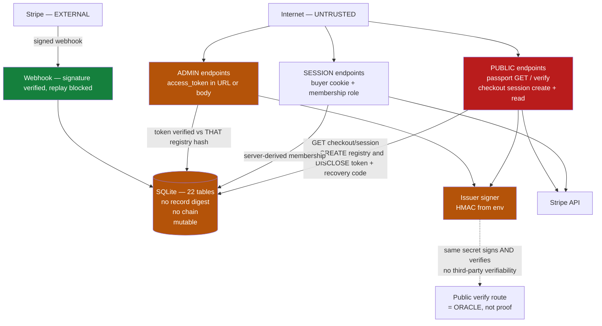

# Agent Passport Web Threat Model

- Status: canonical. Produced by Prompt 2.5 of the Security & Containment Architecture track.
- Base: `claude/frontera-trust-boundaries`, with Prompt 0, Prompt 1 and Prompt 2 artifacts present.
- Method: read from source. Prompt 2's findings were re-verified rather than assumed; three of its statements are corrected below.

---

## 1. Purpose

Prompt 0 recorded SC-006: `apps/agent-passport-web` is a production-shaped SaaS surface with API routes, authentication, privileged mutations, issuer signing material, Stripe integration and its own persistence, and it sat outside every Frontera security artifact. Prompt 2 mapped that surface. This document threat-models it.

It answers: what the trust boundaries are, what authority and data can be mutated, what secrets are held, which routes are reachable and under what control, what Stripe can cause, what each principal can do, where guarantees stop, and which risks block production.

It is audit-first. No major mitigation is implemented here.

## 2. Scope

`apps/agent-passport-web/**` — 31 route files exposing **35 method+path endpoints**, one SQLite database with 22 tables, four production secrets, two independent HMAC signing schemes, and a Stripe integration in both directions.

Out of scope: `src/**` and `packages/**` (covered by `THREAT_MODEL_V1.md` and `TRUST_BOUNDARIES_AND_PRIVILEGED_ASSETS.md`).

## 3. Relationship to Frontera Core

Agent Passport Web is a **separate application TCB** (TZ-2 in the trust-boundary map). Three consequences must not be blurred:

1. **Its app-level authorization is not the bounded-grant path.** Nothing in this application passes through `AocKernel`, a `BoundedGrant`, or `GrantExecutionService`. SEC-INV-011 does not apply to any route here.
2. **Compromise of this app does not automatically compromise Frontera Core invariants** — the two run as separate processes with separate stores and separate secrets, and `src/enterprise` never imports this application. What it *does* compromise is every asset in §15 and every record in §14.
3. **Core invariants must not be claimed for this app.** It has no digest chain, no append-only store interface, no tenant scoping enforced at a store layer, and no Kernel decision. Any statement of the form "Frontera guarantees X" is, for this application, unproven unless proven here.

### Corrections to Prompt 2

Re-verification found three statements in the Prompt 2 result that do not hold for this application:

| Prompt 2 said | Actually |
|---|---|
| The app contains "privileged lifecycle operations" (issue/activate/suspend/reactivate/revoke/retire) | **Only issuance.** `updatePassportStatus` and `revokePassport` exist in the repository layer with **zero production callers** — only tests. No route performs a lifecycle transition. The lifecycle routes Prompt 2 cited are in `src/enterprise`'s HTTP adapter, a different application. |
| The app contains "assurance mutations" | **No assurance surface exists in this application at all.** Zero occurrences of `assurance` under `apps/agent-passport-web/src`. Assurance lives in `src/enterprise`. |
| "31 routes" | 31 route **files**; **35 endpoints**, because three files export two methods each (`admin-session` POST+DELETE, `exports` POST+GET, `profile` GET+PATCH). |

TB-001, TB-002 and TB-008 are confirmed, and each is refined with new evidence in §19.

---

## 4. Principals

| Principal | Identity proof | Authority | Tenant reach | Secrets reachable | State it can mutate | External effects |
|---|---|---|---|---|---|---|
| Anonymous Internet caller | none | public routes only | none | none | **registry creation** via `GET /api/checkout/session/[id]` (APW-001) | Stripe checkout session creation |
| Holder of a Stripe `session_id` | possession of a URL-borne id | purchase status read; **passport issuance**; possibly registry creation + credential disclosure | that purchase's registry | — | passports, purchases, registries | **triggers issuer signing** |
| Authenticated user (buyer account) | session cookie → DB session row → active account | account-scoped reads | registries where they hold active membership | none | own account | none |
| Tenant member / admin / viewer / auditor | session + `registry_account_memberships` row | role permissions (§7) | exactly their registry | none | per role | Stripe portal (billing roles) |
| Registry admin-token holder | possession of a 256-bit token | **owner-equivalent, all 11 permissions** | exactly that registry | — | everything in that registry | Stripe portal, exports, issuance |
| Recovery-code holder | possession of a 64-bit single-use code | rotate the admin token → full takeover | that registry | — | admin credential itself | — |
| Global/system administrator | **does not exist** | — | — | — | — | — |
| Stripe | webhook signature over raw body | drive purchase, entitlement and billing state | any registry named by the event | — | purchases, registries, entitlements, billing | — |
| Compromised webhook sender (no valid signature) | none | **none** — `constructEvent` rejects | none | none | none | none |
| Application process | — | everything below | **all tenants** | **all four secrets** | all 22 tables | Stripe API, signing |
| Database/filesystem operator | — | everything | all tenants | credential *hashes* only | all rows, undetectably | — |
| Deployment operator | — | everything, incl. env | all | **all four secrets** | all | all |
| Issuer/signing component | env-loaded HMAC secret | sign any passport | all | is the secret | — | — |
| External verifier | none | calls the public verify route | none | none | none | **none — cannot verify independently** (§11) |
| CI/build actor | repo write / Action | ship a changed artifact | all, eventually | none — CI uses no secrets | build output | — |

Note the absent row: **there is no global/system administrator principal.** Every authority in this application is registry-scoped. That is a genuine positive — there is no cross-tenant super-user to compromise.

---

## 5. Route Inventory

35 endpoints across 31 files. `Tenant-scoped?` records where the tenant identifier is *derived*, per §8's vocabulary.

| Method | Route | Class | Auth mechanism | Role | Tenant binding | Writes | External effect | Secret access |
|---|---|---|---|---|---|---|---|---|
| POST | `/api/account/signup` | PUBLIC | none (creates account) | — | n/a | yes | — | — |
| POST | `/api/account/login` | PUBLIC | password (scrypt) | — | n/a | session | — | — |
| POST | `/api/account/logout` | AUTHENTICATED | session cookie | — | n/a | session revoke | — | — |
| GET | `/api/account/me` | AUTHENTICATED | session cookie | — | server-derived | no | — | — |
| GET | `/api/account/registries` | AUTHENTICATED | session cookie | — | SERVER-DERIVED (membership) | no | — | — |
| GET | `/api/account/billing` | AUTHENTICATED | session + membership | role | SERVER-DERIVED | no | — | — |
| POST | `/api/account/claim-registry` | AUTHENTICATED | session + **admin token** | → owner | token↔registry | membership | — | — |
| POST | `/api/agent-passports` | TOKEN / SESSION-ID | registry admin token **or** Stripe `session_id` | → owner | token↔registry | passports, entitlement | **issuer signing** | signing secret |
| GET | `/api/agent-passports/[passportId]` | **PUBLIC** | none | — | none | no | — | — |
| GET | `/api/agent-passports/[passportId]/verify` | **PUBLIC** | none | — | none | verification event | — | signing secret (server-side oracle) |
| POST | `/api/checkout/session` | **PUBLIC** | none | — | n/a | purchase | **Stripe API** | Stripe key |
| GET | `/api/checkout/session/[sessionId]` | **PUBLIC** | none | — | via purchase | **registry creation** | — | **discloses admin token + recovery code** (APW-001) |
| GET | `/api/organization-registry/[registryId]` | ADMIN | token (query) | → owner | token↔registry | no | — | — |
| GET | `/api/organization-registry/[registryId]/passports` | ADMIN | token (query) | → owner | token↔registry | no | — | — |
| GET,PATCH | `/api/organization-registry/[registryId]/profile` | ADMIN | token or admin session | → owner | token↔registry | profile | — | — |
| POST | `/api/organization-registry/[registryId]/enrollment-access` | ADMIN | token (body or query) | → owner | token↔registry | no | — | — |
| POST,GET | `/api/organization-registry/[registryId]/exports` | ADMIN | token (body/query) | → owner | token↔registry | export artifacts | — | — |
| GET | `/api/organization-registry/[registryId]/exports/[exportId]` | ADMIN | token | → owner | token↔registry | no | — | — |
| POST | `/api/organization-registry/[registryId]/admin-access/rotate` | ADMIN | **current token or recovery code** | — | credential↔registry | **admin credential** | — | mints new credential |
| POST,DELETE | `/api/organization-registry/[registryId]/admin-session` | ADMIN | token → sets cookie | → owner | token↔registry | admin session | — | — |
| GET | `/api/organization-registry/[registryId]/billing` | ROLE-RESTRICTED | session + `registry:view_billing` | yes | SERVER-DERIVED | no | — | — |
| POST | `/api/organization-registry/[registryId]/billing/portal` | ROLE-RESTRICTED | session + `registry:manage_billing` | yes | SERVER-DERIVED | no | **Stripe API** | Stripe key |
| GET | `/api/organization-registry/[registryId]/team` | ROLE-RESTRICTED | session + `registry:manage_team` | yes | SERVER-DERIVED | no | — | — |
| POST | `/api/organization-registry/[registryId]/team/invitations` | ROLE-RESTRICTED | session + `registry:invite_team` | yes | SERVER-DERIVED | invitation | — | — |
| POST | `.../team/invitations/[invitationId]/revoke` | ROLE-RESTRICTED | session + role | yes | SERVER-DERIVED | invitation | — | — |
| POST | `.../team/members/[accountId]/role` | ROLE-RESTRICTED | session + `registry:manage_team` | yes | SERVER-DERIVED | **membership role** | — | — |
| DELETE | `.../team/members/[accountId]` | ROLE-RESTRICTED | session + `registry:manage_team` | yes | SERVER-DERIVED | membership | — | — |
| POST | `/api/organization-registry/recover` | PUBLIC-CREDENTIAL | recovery code + email, **or** Stripe session + email | — | credential↔registry | **admin credential** | — | mints new credential |
| GET | `/api/team-invitations/[invitationId]` | **PUBLIC-TOKEN** | invitation token (query) | — | via invitation | no | — | — |
| POST | `/api/team-invitations/accept` | AUTHENTICATED | session + invitation token | — | via invitation | membership | — | — |
| POST | `/api/stripe/webhook` | WEBHOOK | **Stripe signature** | — | via event payload | purchases, registries, entitlements, billing | — | webhook secret |

**Five endpoints are fully unauthenticated**: two passport reads, checkout session create, checkout session read, and (credential-gated but unauthenticated) the invitation read and recover routes.

> **Correction from Prompt 3 (NB-004).** This table enumerates `app/api/**/route.ts` files and is complete for those. It is **not** complete for HTTP-reachable effects: `src/app/enroll-agent/actions.ts` carries `'use server'` and exports `enrollAgentAction`, a Next.js Server Action — HTTP-invocable, not a route file — which triggers **issuer signing**, writes a passport record and decrements registry entitlement capacity under the same two possession-only credentials as `POST /api/agent-passports`. It is additionally weaker than that route: it does not wrap `addPassportToRegistry` in a `try/catch`, so a capacity-exhaustion race throws after the key has already signed. Recorded as EP-037 in `NO_BYPASS_AUTHORITY_CONTROLLED_EXECUTION.md`, and pinned by a structural test that now requires every `'use server'` file to appear in that inventory.

---

## 6. Authentication Model

| Mechanism | Implementation | Assessment |
|---|---|---|
| Buyer session | `randomBytes(32)` → cookie; **SHA-256 hashed at rest**; DB row with `expires_at` and `revoked_at`; 30-day lifetime; `HttpOnly`, `SameSite=Lax`, `Secure` only when `NODE_ENV === 'production'` | **Sound.** Server-side revocable individually and in bulk. No signed-token secret to steal — sessions are DB-backed opaque values. |
| Password | scrypt N=16384 r=8 p=1, 16-byte salt, 64-byte key, `timingSafeEqual`; min length 10 | **Sound.** |
| Registry admin token | `randomBytes(32)`, SHA-256 at rest, `timingSafeEqual` | Comparison sound; **transport and lifetime are not** (§12). |
| Registry admin session | token → cookie `aoc_registry_admin_session`, SHA-256 at rest, expiry + revocation | Sound; **an existing, safer alternative to the URL token.** |
| Recovery code | `randomBytes(8)` = 64 bits, SHA-256 at rest, `timingSafeEqual`, **single-use** (`recovery_code_used_at`) | Adequate: single-use and online-only. Its email second factor is **caller-optional** (APW-008). |
| Stripe webhook | `stripe.webhooks.constructEvent` over the **raw body**; 503 when the secret is unset | **Sound and fails closed.** |
| Refresh | none | Sessions are fixed-lifetime; no refresh path. |
| **CSRF** | **No token, no Origin check, no Referer check anywhere.** Only `SameSite=Lax` | **FRAMEWORK/BROWSER-DEPENDENT** — not enforced by this application. See APW-005. |
| Header trust | no authentication is taken from arbitrary headers | Good. |
| URL-parameter trust | **`access_token` is accepted from the query string** in six endpoints | See APW-002. |

Per Step 3: the CSRF property is **FRAMEWORK-DEPENDENT**, not *enforced by Frontera*. It rests on browser `SameSite` behaviour, and it is irrelevant to the token-bearing routes, which need no cookie at all.

---

## 7. Authorization and RBAC

Five roles, eleven permissions, defined server-side in `registry-role-policy.ts` as a static map. Role is **stored server-side** in `registry_account_memberships` and is never read from the client.

| Role | Permissions |
|---|---|
| `owner` | all 11, including `rotate_admin_access` and `recover_access` |
| `admin` | 9 — all but `rotate_admin_access`, `recover_access` |
| `member` | `view`, `enroll_agent`, `generate_exports`, `download_exports` |
| `viewer` | `view`, `download_exports` |
| `auditor` | `view`, `generate_exports`, `download_exports` |

### Enforcement sites

`resolveRegistryAccessFromRequest` (`registry-account-access.ts`) is the shared helper, and its order matters:

1. Session → `getRegistryMembership(registryId, account.accountId)` → active? → `roleHasPermission(role, requiredPermission)`.
2. **If the account has an active membership but lacks the permission, it returns `null` and does not fall through.** This is a deliberate fail-closed choice worth naming: a low-privilege member who also holds the admin token is *denied*, not escalated.
3. If there is no membership at all, it falls through to the admin token/session, which is mapped to **`role: 'owner'` with all owner permissions**.

### The correction to TB-002

Prompt 2 said the token path "bypasses RBAC". More precisely: **it does not bypass the role check — it is mapped to owner-equivalent.** The net effect (possession ⇒ full control) is the same, but the mechanism is an escalation path, not an absent check, and the distinction matters for remediation.

### Inconsistency found

Ten admin routes do **not** use the shared helper at all. They call `verifyRegistryAccess(registryId, accessToken)` directly — token only. Consequences:

- A buyer-account **owner** with a valid session **cannot** call them; only a token holder can.
- The permission `registry:rotate_admin_access`, defined for `owner`, **has no route that honours it**: rotation accepts only a token or a recovery code.

So the RBAC model governs the team/billing routes and is simply absent from the registry-operations routes. Recorded as APW-007.

---

## 8. Tenant Isolation

Classification of every tenant-identifier source:

| Pattern | Classification | Evidence |
|---|---|---|
| Session → membership lookup keyed by `(registryId, accountId)` | **SERVER-DERIVED** | `registry-account-access.ts` |
| `registryId` from path + token verified against **that registry's own hash** | **CALLER-SUPPLIED-BUT-VALIDATED** | `verifyRegistryAccess` — `getRegistryByRegistryId(registryId)` then `verifyRegistryAdminAccessToken(token, registry.adminAccessTokenHash)` |
| `listRegistryPassports(registryId)`, `getEntitlementByRegistryId(registryId)` | scoped by the validated id | repository layer |
| Invitation token → invitation row → `registry_id` | **SERVER-DERIVED from the credential** | `getRegistryTeamInvitationByToken` |
| Stripe event → purchase/registry lookup | **SERVER-DERIVED from the event's own ids** | webhook handler |

**No CALLER-SUPPLIED-UNBOUND pattern was found.** Specifically checked and *not* present:

- **IDOR on registry routes** — registry A's token fails against registry B's stored hash, so the path id cannot be swapped.
- **Body-overrides-session** — no route reads a tenant id from the body and trusts it in place of the session-derived membership.
- **Query-by-object-id without tenant predicate** — registry queries carry `registryId`.

Two real exposures that are *not* cross-tenant escalation but are read exposure:

- `GET /api/agent-passports/[passportId]` and `/verify` are **globally unauthenticated**: any passport is readable by id, across all tenants. This is the product's public-verifiability design, but it means passport records are world-readable and passport ids must be treated as public.
- `GET /api/team-invitations/[invitationId]` discloses `registryId`, `organizationName`, `invitedEmail` and `role` to any holder of the invitation token.

**Assessment: tenant isolation in this application is sound where it is applied.** That is a genuine positive and the strongest security property the app has.

## 9. Passport Lifecycle

**Correcting Prompt 2:** this application exposes **one** lifecycle operation — issuance. There is no activate, suspend, reactivate, revoke or retire route. `updatePassportStatus` and `revokePassport` exist in the repository layer with **zero production callers**.

| Transition | Route | Who | Prior state | Server-side validation | Tenant re-check | Append-only | Replayable |
|---|---|---|---|---|---|---|---|
| *(none)* → `issued` via registry | `POST /api/agent-passports` with `registry_id` + `access_token` | token holder | registry `active`, entitlement `active`, `remainingQuantity > 0` | yes | yes — token↔registry | passport row inserted; `passport_status_events` appended | capacity-bounded |
| *(none)* → `issued` via purchase | `POST /api/agent-passports` with `session_id` | holder of the Stripe session id | purchase `completed` and not already issued | yes | via purchase | as above | **single-use** — second attempt returns 409 |

Both paths **trigger issuer signing**. Issuance authorization and signing authorization are therefore **the same authorization**: whoever can issue can cause the issuer key to sign (§11, item 12).

There is no state machine to attack because there are no transitions. The risk here is issuance volume, not illegal transitions — and issuance is bounded by entitlement capacity (registry path) or single-use (purchase path). `passport_status_events` provides history, but it is a mutable table like every other (§14).

## 10. Assurance State

**No assurance surface exists in this application.** Zero occurrences of `assurance` under `apps/agent-passport-web/src`. The Assurance Runtime is in `src/enterprise` and is covered by `THREAT_MODEL_V1.md` §7.11–7.14.

The application does carry two adjacent fields on registry passports — `governanceStatus` and `runtimeGuardReady` — returned by the registry passports listing. Neither gates any enforcement decision in this application; they are display state. Stating that plainly is the point: they read as security-relevant and are not.

---

## 11. Issuer and Signing Model

Answering Step 8's twelve questions from source:

| # | Question | Answer |
|---|---|---|
| 1 | What algorithm signs? | **HMAC-SHA256**, twice over, in two independent schemes. |
| 2 | Symmetric or asymmetric? | **Symmetric.** No asymmetric signing exists anywhere in the application. |
| 3 | What material signs? | Scheme A: `AOC_ISSUER_PRIVATE_KEY_PEM` passed as the HMAC `secret` to `createTestSigner` (`issuer-signer.ts:52`). Scheme B: `PASSPORT_SIGNING_SECRET` in `passport-issuer.ts:50`. |
| 4 | What material verifies? | **The same secret.** Verification is HMAC recomputation. |
| 5 | Can a third party verify independently? | **No.** The only verification available to an outsider is `GET /api/agent-passports/[id]/verify`, which recomputes server-side and returns a verdict. That is a **verification oracle**, not independent verifiability. |
| 6 | Does possession of verification material enable signing? | **Yes** — they are the same value. This is the defining property of a MAC and the reason `AOC_ISSUER_PUBLIC_KEY_PEM` is misleading: it is registered as an issuer "public key" with `algorithm: 'hmac-sha256'`, so it verifies nothing, and the value that *would* verify also forges. |
| 7 | Key id / versioning? | A `keyId` exists (`AOC_ISSUER_KEY_ID`), and `issuer_keys` / `issuer_key_events` tables exist. |
| 8 | Is rotation supported? | **Operationally, no.** |
| 9 | Do old signatures verify after rotation? | **No.** `verifyAgentPassportBundle` builds its verifier from `createIssuerSignerFromEnv()` — the single current env key — and **never consults `SqliteIssuerKeyRepository`**. `createTestSigner.verify` rejects on `signature.keyId !== keyId` *and* on HMAC mismatch. Rotating the secret or the key id therefore invalidates **every previously issued passport**. |
| 10 | Process-resident? | **Yes**, both secrets, for the process lifetime. `PASSPORT_SIGNING_SECRET` is additionally cached in a module-level variable (`issuer-config.ts`), so clearing it requires a restart. |
| 11 | Can a route indirectly trigger signing? | **Yes** — `POST /api/agent-passports` (both paths) and the verify route (verification-side HMAC). |
| 12 | Is signing authorization separate from issuance authorization? | **No.** They are the same authorization: registry token, or Stripe `session_id`. |

### Vocabulary, stated precisely

| Term | What exists here |
|---|---|
| **SIGNATURE** (asymmetric, non-repudiable) | **Does not exist.** |
| **MAC** | What the application actually produces, twice. |
| **DIGEST** | SHA-256 over credentials at rest, and `checksum_sha256` on export artifacts. |
| **TOKEN** | Opaque random bearer values (session, admin, invitation). Not signed, not self-describing — server-side lookup. |
| **ATTESTATION** | Not produced by this application. |

A passport MAC provides **integrity and authenticity relative to the issuer**, and **not non-repudiation** — the issuer can forge any passport, and so can anyone holding the secret. Calling it a signature would be wrong.

## 12. Registry Admin Credential

Confirming and extending TB-001 and TB-002 from source.

| Question | Answer |
|---|---|
| Where created? | `createRegistryAdminAccessToken()` — `randomBytes(32)`, hex. **Random, not static.** |
| Lifetime? | **Permanent.** The registry row has `admin_access_token_created_at`, `_rotated_at`, `_last_used_at` and **no expiry column**. |
| Stored how? | SHA-256 hash on the registry row. Plaintext is returned to the caller exactly once, at creation. |
| Passed how? | `url.searchParams.get('access_token')` (`registry-admin-access.ts:50`), request body, or exchanged for the `aoc_registry_admin_session` cookie. |
| Appears in query strings? | **Yes.** |
| Appears in navigable links? | **Yes** — `/registry/admin?registry_id=…&access_token=…` is constructed in four places and returned to users as `adminUrl`/`registryUrl`. |
| Browser history? | **Yes**, as a consequence. |
| Server/proxy/CDN logs? | **Yes**, as a consequence. |
| Referrer headers? | Limited — the admin page renders inline styles and loads no external subresource, so no third-party `Referer` leak was found. |
| Analytics? | No analytics integration exists in the application. |
| Copied links / screenshots? | Yes — the URL is explicitly presented as the thing to save ("Save your admin URL and recovery code securely"). |
| What does it authorize? | Owner-equivalent: all eleven registry permissions, plus the ten token-only routes the RBAC path cannot reach. |
| Possession sufficient? | **Yes.** No second factor, no binding to an account, IP, or device. |
| Tenant-bound? | **Yes** — verified against that registry's own hash. It cannot be replayed against another registry. |
| Role-bound? | **No** — mapped to `owner`. |
| Revocable? | Only by rotation, which mints a replacement. There is no "revoke without replace". |
| Rotatable? | Yes — `POST .../admin-access/rotate`, authorized by the current token or the recovery code. |
| Bypasses RBAC? | Escalates *to* owner rather than bypassing the check (§7). |
| Privilege escalation? | Yes, for an account with **no** membership. An account **with** a lower-privileged membership is denied rather than escalated. |

## 13. Stripe Boundary

### Inbound — Stripe → application

| Control | Present | Evidence |
|---|---|---|
| Signature verification | **Yes** | `stripe.webhooks.constructEvent(rawBody, sig, secret)` over the **raw** body |
| Fails closed when unconfigured | **Yes** — 503 | `webhook/route.ts:51-55` |
| Missing signature header rejected | **Yes** — 400 | `:58-61` |
| Timestamp tolerance | **Stripe SDK default** (5 minutes) — not set explicitly by this application | FRAMEWORK-DEPENDENT |
| Replay handling | **Yes** — `stripe_webhook_events` with `UNIQUE(stripe_event_id)`; insert failure signals already-processed | `stripe-webhook-repository.ts` |
| Event-type allowlisting | **Yes** — a `switch` over named event types; unhandled types fall through | `:142+` |
| Tenant binding | **Server-derived** from the event's own purchase/registry ids | — |
| Idempotency | Per-event, via the unique constraint | — |

**Assessment: the inbound boundary is correctly built.** The one thing it does not do — and cannot — is prove that the *business state transition* the event drives is authorized; it proves only that Stripe sent the event. That distinction is preserved deliberately here.

The material coupling: **when the webhook is unconfigured or failing, registries are never created by it**, and the only remaining creation path is the unauthenticated `GET /api/checkout/session/[sessionId]`, which discloses credentials (APW-001). The safety of that endpoint therefore depends on webhook health.

### Outbound — application → Stripe

| Aspect | Finding |
|---|---|
| Secret handling | `STRIPE_SECRET_KEY` read at client construction via a dynamic `require('stripe')`; process-resident |
| Routes that cause Stripe calls | `POST /api/checkout/session` (**unauthenticated**), `POST .../billing/portal` (session + `registry:manage_billing`) |
| Price/product ids | Server-side, from `pricing.ts` — **not caller-supplied** |
| Customer id binding | Server-derived from the registry's billing profile |
| Tenant binding | Server-derived |
| Idempotency keys | **Not used** on outbound calls |
| User-controllable fields | Organization profile metadata and success/cancel URLs are built server-side from `NEXT_PUBLIC_*` config |
| Cross-customer effect | **Not reachable** — no route accepts a caller-supplied Stripe customer id |

A malicious tenant **cannot** cause effects on another tenant's Stripe customer. The unauthenticated checkout-session route can create unlimited Stripe checkout sessions (cost/noise, not cross-tenant compromise), bounded only by deployment rate limiting, which does not exist in-application.

## 14. Persistence and Integrity

- **Technology:** SQLite via `better-sqlite3`, one file at `AOC_AGENT_PASSPORT_DB_PATH` (default `.data/agent-passport.sqlite`).
- **22 tables**, including seven event/history tables: `passport_status_events`, `passport_verification_events`, `registry_admin_access_events`, `registry_account_events`, `registry_billing_events`, `issuer_key_events`, `runtime_guard_audit_events`.
- **Mutation style:** `UPDATE` is used on twelve tables — `purchases` (7), `organization_registries` (7), `registry_team_invitations` (3), `buyer_accounts` (3), `stripe_webhook_events` (2), `registry_account_memberships` (2), `passports` (2), `buyer_account_sessions` (2), `agent_passports` (2), `registry_admin_sessions` (1), `organization_registry_entitlements` (1), `issuer_keys` (1).
- **Deletes:** exactly one — `DELETE FROM registry_export_artifacts`.
- **Uniqueness constraints:** present, and load-bearing for webhook replay (`stripe_event_id`).
- **Transactions:** used for multi-row operations such as issuance + capacity decrement.
- **Optimistic locking / row versioning:** **none.**
- **Integrity mechanisms:** **none at record level.** The only SHA-256 uses are credential hashing at rest and `checksum_sha256` on export artifacts. There is no per-row digest, no chain, no `previous_*` linkage, and no `verify` surface.

### The four properties, separated

| Property | Present? |
|---|---|
| **TAMPER PREVENTION** | No — every authority-bearing table is mutable by the process and by anyone with file access. |
| **TAMPER DETECTION** | **No.** This is the material difference from `src/enterprise`, where digests and chains make silent modification detectable on `verify`. Here, a modified row is indistinguishable from a legitimate one. |
| **ATTRIBUTION** | **Partially — better than Prompt 2 recorded.** Seven event tables record who did what and when. But they are ordinary mutable tables with no chain, so they attribute honest activity and do not survive a determined writer. |
| **RECOVERY** | Backup-dependent, and **no backup procedure is documented for this application** — the operations documents cover the three `src/enterprise` stores only. |

**If the DB is modified by a privileged process or operator, what security claims remain true?** Only those that do not depend on stored state: the HMAC on an already-issued passport bundle still verifies *if* the bundle JSON is unmodified and the secret is unchanged. Everything else — registry ownership, membership roles, entitlement capacity, admin credential hashes, billing status, and every event log — can be rewritten with no detectable trace.

## 15. Secret Inventory

Searched, not assumed: every `process.env.*` reference under `apps/agent-passport-web/src`.

| Secret | Source | Process-resident? | Long-lived? | Consumer | Rotation | Blast radius |
|---|---|---|---|---|---|---|
| `AOC_ISSUER_PRIVATE_KEY_PEM` | operator env | **Yes** | **Yes** | `createIssuerSignerFromEnv` → HMAC secret | Restart — **and invalidates every existing passport** | Forge any passport |
| `PASSPORT_SIGNING_SECRET` | operator env | **Yes**, plus a module-level cache | **Yes** | `signAgentPassportPayload` / `verifyAgentPassportPayload` | Restart | Forge passport payload MACs (second, independent scheme) |
| `STRIPE_SECRET_KEY` | operator env | **Yes** | **Yes** | Stripe SDK | Restart | Full merchant account — money |
| `STRIPE_WEBHOOK_SECRET` | operator env | **Yes** | **Yes** | `constructEvent` | Restart | Forge billing events ⇒ forge entitlements |
| `AOC_DEV_SIGNING_SECRET` | env, **with a checked-in literal fallback** | — | — | `createDevSigner` — **zero call sites**; and the dev branch of `issuer-signer.ts` | — | Dev-only; see APW-012 |

Non-secret configuration: `AOC_ISSUER_ID`, `AOC_ISSUER_KEY_ID`, `AOC_ISSUER_PUBLIC_KEY_PEM` (metadata only — verifies nothing under HMAC), `PASSPORT_ISSUER_*`, `AOC_ALLOW_DEV_SIGNER`, `NODE_ENV`, DB paths, and two `NEXT_PUBLIC_*` base URLs.

Two positives worth recording explicitly:

- **No secret carries the `NEXT_PUBLIC_` prefix**, so no secret is inlined into the client bundle by Next.js convention.
- **There is no session-signing secret and no database credential.** Sessions are DB-backed opaque random values, so there is no session key to steal, and SQLite needs no credential.

## 16. Data Classification

| Class | Data |
|---|---|
| **PUBLIC** | Passport public verification payload, verification verdicts, organization name (via invitation lookup) |
| **TENANT-CONFIDENTIAL** | Registry profile, passport listings, entitlement and capacity, team membership and roles, export artifacts |
| **SECURITY-SENSITIVE** | Session token hashes, admin token hash, recovery code hash, password hashes, invitation tokens |
| **PRIVILEGED** | Plaintext admin access token and recovery code at the moment of creation; the two HMAC secrets; the Stripe keys |
| **BILLING** | Purchases, Stripe customer/subscription ids, billing status, portal sessions |
| **AUDIT / EVIDENCE** | The seven `*_events` tables |

Personal information handled: **account email addresses**, buyer contact emails, invited-member email addresses, and agent owner names. Billing identifiers are Stripe-side; no card data is handled by this application. This is an architectural classification only — no legal or regulatory conclusion is drawn.

## 17. Trust Boundary Diagram

## 18. Abuse-Case Matrix

| # | Scenario | Result | Evidence |
|---|---|---|---|
| A | Anonymous reads another tenant's passport | **NOT ADDRESSED — by design** | `GET /api/agent-passports/[id]` is unauthenticated; public verifiability is the product. Passport ids must be treated as public. |
| B | Authenticated user guesses another tenant's object id | **BLOCKED** | Registry routes verify the token against that registry's own hash; session routes derive membership from `(registryId, accountId)`. |
| C | Tenant user submits another tenant id in body/query/path | **BLOCKED** | No CALLER-SUPPLIED-UNBOUND pattern found (§8). |
| D | Tenant administrator attempts system-admin function | **NOT APPLICABLE** | No global/system administrator principal exists. |
| E | Stolen registry admin URL/token replayed | **NOT ADDRESSED** | Permanent, possession-sufficient, no binding to account/IP/device. APW-002. |
| F | Admin token leaks via history / referrer / logs | **PARTIALLY BLOCKED** | Referrer leak limited (no external subresources); history, logs and shared links are fully exposed. APW-002. |
| G | Malicious authenticated user repeatedly issues passports | **PARTIALLY BLOCKED** | Bounded by entitlement `remainingQuantity` on the registry path and single-use on the purchase path. No rate limiting. |
| H | Malicious tenant repeatedly changes lifecycle state | **NOT APPLICABLE** | No lifecycle transition route exists in this application (§9). |
| I | Suspended/revoked passport reactivated by an unintended path | **NOT APPLICABLE** | Same — no transition routes; `updatePassportStatus` has no production caller. |
| J | DB operator directly changes passport state | **NOT ADDRESSED** | No record digest, no chain — undetectable (§14). |
| K | DB operator modifies tenant ownership | **NOT ADDRESSED** | `organization_registries` and `registry_account_memberships` are mutable with no integrity control. |
| L | Application process compromised | **NOT ADDRESSED** | All four secrets, all 22 tables, signing, and Stripe become available. |
| M | Issuer signing secret stolen | **NOT ADDRESSED** | Forge any passport; the public verify route will affirm the forgery. APW-004. |
| N | Stripe secret stolen | **NOT ADDRESSED** | Full merchant account access. Deployment-owned. |
| O | Stripe webhook replayed | **BLOCKED** | Signature + `UNIQUE(stripe_event_id)` deduplication. |
| P | Valid Stripe event applied to wrong tenant | **BLOCKED** | Tenant derived server-side from the event's own purchase/registry ids. |
| Q | Attacker forges or modifies a passport | **PARTIALLY BLOCKED** | Requires the HMAC secret; without it, verification fails. With DB access, the *bundle* can be replaced but its MAC will not verify — **the one integrity property that survives DB compromise**. |
| R | External verifier assumes asymmetric verification | **NOT ADDRESSED** | Only HMAC exists; the "public key" verifies nothing. The verify route is an oracle. APW-004. |
| S | Public verify route leaks more than intended | **PARTIALLY BLOCKED** | Returns a public payload plus reason codes; it does not return the seal secret or raw bundle. But it confirms existence of any passport id. |
| T | Admin bearer credential bypasses five-role RBAC | **PARTIALLY BLOCKED** | Mapped to owner-equivalent; an account holding a *lower* membership is denied rather than escalated (§7). APW-002. |
| U | CI/build artifact maliciously changed | **DEPLOYMENT-DEPENDENT** | No secrets in CI; release artifacts checksum-pinned; no `permissions:` block (TB-007). |
| V | Session or auth material stolen | **PARTIALLY BLOCKED** | `HttpOnly` + `SameSite=Lax` + `Secure` in production; server-side revocable. No CSRF token (APW-005). |
| W | Compromised process reads every environment secret | **NOT ADDRESSED** | Ambient `process.env`; no broker, no scoping. |
| X | Evidence/history modified or deleted | **NOT ADDRESSED** | The seven event tables are ordinary mutable tables (§14). |

---

## 19. Findings

### APW-001 — Unauthenticated endpoint creates a registry and discloses its admin credential and recovery code
- **Status: REMEDIATED** (Prompt 2.6). Original severity HIGH. The finding is retained in full below for audit history; the remediation follows it.
- **Severity:** HIGH (as originally assessed)
- **Affected surface:** `GET /api/checkout/session/[sessionId]`
- **Evidence:** the handler takes no session, no token and no signature (`checkout/session/[sessionId]/route.ts:16-20`). Given a `sessionId` with a completed purchase and no existing registry, it calls `ensureOrganizationRegistry` (`:57`) — a **state mutation on an unauthenticated GET** — and when `result.wasCreated` is true it returns `adminAccessToken` and `recoveryCode` **in cleartext in the response body** (`:81-82`), together with the constructed `adminUrl` (`:69`). The `sessionId` itself is URL-borne: `checkout/session/route.ts:84` sets `successUrl` to `/checkout/success?session_id={CHECKOUT_SESSION_ID}&purchase_id=…`.
- **Threat:** anyone who obtains the Stripe session id — from browser history, a shared link, a proxy or CDN log, or a `Referer` — can call this endpoint. If the registry has not yet been created, they receive permanent owner-equivalent control of it **and** the recovery factor that would let the legitimate buyer take it back.
- **Consequence:** full, permanent registry takeover with no recovery path for the victim, who then receives only "Registry exists. Use the admin URL from your checkout confirmation" and never gets a credential. Both factors are delivered in a **single response**, so one leaked response is total.
- **Existing mitigation:** credentials are returned only on first creation (`wasCreated`); the purchase must be `completed`; Stripe session ids are high-entropy and not guessable; in the normal flow the **webhook creates the registry first**, so this branch does not fire.
- **Residual risk:** the mitigation is a race, and it is coupled to webhook health. If `STRIPE_WEBHOOK_SECRET` is unset the webhook returns 503 (`webhook/route.ts:51-55`) and never creates registries — making this unauthenticated endpoint the **only** creation path, and credential disclosure the **normal** path rather than a fallback.
- **Recommended future owner:** APPLICATION. Pre-production required.

#### APW-001 remediation (Prompt 2.6)

**Previous exploit condition.** An unauthenticated `GET` with a Stripe checkout session id, for a `completed` organization-tier purchase whose registry did not yet exist, caused registry creation and returned `adminAccessToken` and `recoveryCode` in cleartext in the same response. Because the session id travels in the success URL, possession of that URL was sufficient for permanent registry takeover including the recovery factor.

**What changed.** `GET /api/checkout/session/[sessionId]` is now read-only. It no longer imports or calls `ensureOrganizationRegistry`, mints no credential, and names none in its response. When no registry exists it reports `registryPending` and stops. Registry creation now originates solely from the signature-verified Stripe webhook.

**New invariants**, each covered by a test in `apps/agent-passport-web/__tests__/apw-001-checkout-disclosure.test.ts`:

| Id | Invariant |
|---|---|
| APW-FIX-001 | A checkout session id alone cannot authorize disclosure of registry administrative credentials. |
| APW-FIX-002 | `GET /api/checkout/session/[sessionId]` cannot create a registry. |
| APW-FIX-003 | Registry creation originates from the signature-verified webhook path. |
| APW-FIX-004 | The unauthenticated checkout status route is read-only. |
| APW-FIX-005 | Before creation completes, the route returns a non-secret pending state. |
| APW-FIX-006 | `adminAccessToken` and `recoveryCode` never appear in an unauthenticated response. |
| APW-FIX-007 | Absent or failing webhook processing fails closed — no fallback issuance. |
| APW-FIX-008 | Webhook-driven onboarding continues to work, idempotently. |

**Legitimate onboarding after the fix.** Administrative access is obtained through the pre-existing `POST /api/organization-registry/recover` with `mode: 'checkout_session'`, which requires the session id **and** the buyer contact email, confirms `payment_status === 'paid'` with Stripe directly, refuses when the registry does not exist, rotates the credential, revokes prior admin sessions, and records an audit event. That path is strictly stronger than what was removed — two factors and a live payment check, versus a single URL-borne identifier. It already has a UI at `/registry/recover`; the checkout success page now links to it.

**Test evidence.** 14 assertions. The suite was verified against the pre-fix route: restoring the vulnerable handler fails five independent assertions (creation-primitive import, credential naming, the first-creation branch, the unauthenticated-route sweep, and the no-fallback check), and passes only with the remediation in place.

**Residual risk — explicitly not closed by this fix:**

- **APW-002 is untouched.** The admin credential remains permanent, URL-borne once obtained, and owner-equivalent. The recovery flow still returns an `adminUrl` containing the token. This fix removes the *unauthenticated* disclosure path only.
- **Availability is now coupled to webhook health.** Failing closed is deliberate (APW-FIX-007), but a broken or unconfigured Stripe webhook now blocks organization onboarding entirely rather than silently degrading to unauthenticated issuance. That is the correct trade, and it makes webhook configuration an operational prerequisite — see §23, Prompt 17.
- **The recovery path inherits APW-008**: its email second factor is caller-optional in the `recovery_code` mode. The `checkout_session` mode used for onboarding requires the email.

### APW-002 — Registry admin credential is permanent, URL-borne, and owner-equivalent
- **Severity:** HIGH · Confirms and refines **TB-001** and **TB-002**
- **Affected surface:** ten token-only routes plus `app/registry/admin/page.tsx`
- **Evidence:** read from `url.searchParams.get('access_token')` (`registry-admin-access.ts:50`); embedded in navigable URLs at `claim-registry/route.ts:46,59`, `agent-passports/route.ts:76`, `checkout/session/[sessionId]/route.ts:69`; the registry row has no expiry column (`organization-registry-repository.ts:34-47`); `registry-account-access.ts` maps it to `role: 'owner'` with all eleven permissions.
- **Threat:** possession alone, indefinitely, from any device.
- **Consequence:** full registry administration — enrol agents (triggering issuer signing), manage team, generate and download exports, manage billing.
- **Existing mitigation:** `timingSafeEqual` over 256 bits; tenant-bound (cannot be replayed against another registry); admin access events recorded; rotation and single-use recovery exist; an `aoc_registry_admin_session` cookie path **already exists** as a safer alternative; and an account holding a *lower* membership is denied rather than escalated.
- **Residual risk:** every URL-borne exposure channel, with no expiry to bound it.
- **New evidence beyond TB-001/TB-002:** the credential is **owner-equivalent by mapping**, not by absent check; and ten routes accept *only* this credential, so the RBAC path cannot reach them at all.
- **Recommended future owner:** APPLICATION. Pre-production required.

### APW-003 — Issuer key rotation invalidates every previously issued passport
- **Severity:** MEDIUM
- **Affected surface:** `verifyAgentPassportBundle`, `issuer-signer.ts`
- **Evidence:** verification builds its verifier from `createIssuerSignerFromEnv()` (`passport-adapter.ts:116`) and **never consults `SqliteIssuerKeyRepository`**, despite `issuer_keys` and `issuer_key_events` tables existing. `createTestSigner.verify` rejects when `signature.keyId !== keyId` or the HMAC differs.
- **Threat:** not an attacker action — an operational one. Rotating a suspected-compromised key breaks every passport already issued.
- **Consequence:** rotation is effectively unavailable, so a compromised issuer secret cannot be retired without invalidating the product's entire output. That converts APW-004's blast radius from *recoverable* to *permanent*.
- **Existing mitigation:** none. The key-history tables exist but are unused by the verify path.
- **Recommended future owner:** Prompt 6 (KMS/HSM boundaries) — key-history verification is a prerequisite for any rotation story.

### APW-004 — Passport authenticity is a MAC, and the public verify route is an oracle
- **Severity:** MEDIUM · Confirms **SC-004** in the web-application context
- **Affected surface:** both signing schemes; `GET /api/agent-passports/[id]/verify`
- **Evidence:** `algorithm: 'hmac-sha256'` (`issuer-signer.ts:27,40`); `createHmac('sha256', secret)` (`passport-issuer.ts:50`); `AOC_ISSUER_PUBLIC_KEY_PEM` registered as an issuer public key under that symmetric algorithm.
- **Threat:** a relying party assumes a passport carries a verifiable signature.
- **Consequence:** there is **no non-repudiation** and **no independent verifiability**. A third party must trust this server's verdict. Anyone holding the verification material can forge, because it is the signing material.
- **Existing mitigation:** the secret is server-side only; `passport-issuer.ts` uses `timingSafeEqual` (though `createTestSigner.verify` uses `===`, a timing side channel on the live issuer path — carried from SC-004).
- **Residual risk:** any external claim of "verifiable passports" is currently unfounded.
- **Recommended future owner:** Prompt 5 (cryptographic authenticity) and Prompt 6.

### APW-005 — No CSRF defense beyond SameSite
- **Severity:** MEDIUM
- **Affected surface:** every cookie-authenticated state-changing route
- **Evidence:** no CSRF token, no `Origin` check and no `Referer` check anywhere under `apps/agent-passport-web/src`. The only relevant control is `SameSite=Lax` on the two session cookies.
- **Threat:** cross-site state change against an authenticated user.
- **Consequence:** membership role changes, member removal, invitations and billing-portal creation are protected only by browser `SameSite` enforcement.
- **Existing mitigation:** `SameSite=Lax` blocks cross-site POST with cookies in current browsers — but this is **FRAMEWORK/BROWSER-DEPENDENT**, not enforced by the application, and it is irrelevant to the token-bearing routes, which carry no cookie.
- **Recommended future owner:** APPLICATION. Defense-in-depth.

### APW-006 — The application store has no tamper detection
- **Severity:** MEDIUM · Confirms **TB-008**, with a correction
- **Affected surface:** all 22 tables
- **Evidence:** §14. Twelve tables take `UPDATE`; no per-row digest, no chain, no `verify` surface. The only SHA-256 uses are credential hashing and export-artifact checksums.
- **Threat:** a privileged writer or file-level attacker.
- **Consequence:** registry ownership, membership roles, entitlement capacity, credential hashes and billing state can all be rewritten **undetectably**. In `src/enterprise` the equivalent attack is detectable on `verify`; here it is not.
- **Correction to TB-008:** attribution is **better** than Prompt 2 recorded — seven `*_events` tables record actor and time. They are, however, ordinary mutable tables, so they attribute honest activity and do not survive a determined writer.
- **Existing mitigation:** the passport bundle's own MAC still fails to verify if the bundle is edited — the one integrity property that survives DB compromise.
- **Recommended future owner:** Prompt 15 (tamper-evident evidence). Pre-production required for multi-tenant use.

### APW-007 — Two disjoint authorization paths; one RBAC permission has no route
- **Severity:** MEDIUM
- **Affected surface:** ten token-only registry routes; `registry-role-policy.ts`
- **Evidence:** those routes call `verifyRegistryAccess(registryId, accessToken)` directly instead of `resolveRegistryAccessFromRequest`. Consequently a buyer-account **owner** with a valid session cannot call them. The permission `registry:rotate_admin_access` is defined for `owner` but **no route honours it** — rotation accepts only a token or recovery code.
- **Threat:** inconsistent enforcement, and a role model that does not describe the real authorization surface.
- **Consequence:** the RBAC model governs team and billing routes and is absent from registry-operations routes, so reasoning about "what can a `member` do?" from the role table alone gives the wrong answer.
- **Existing mitigation:** both paths are individually tenant-bound and fail closed.
- **Recommended future owner:** APPLICATION. Pre-production required.

### APW-008 — The recovery code's email second factor is caller-optional
- **Severity:** LOW
- **Affected surface:** `rotateRegistryAdminToken`, `POST /api/organization-registry/recover`
- **Evidence:** `organization-registry-service.ts:150` — `if (opts.buyerContactEmail)`. When the caller omits the field, the email comparison is skipped entirely and the recovery code alone authorizes rotation.
- **Threat:** an attacker holding only the recovery code omits the email and succeeds.
- **Consequence:** the intended two-factor recovery degrades to one factor at the attacker's choice.
- **Existing mitigation:** the code is single-use, 64-bit, online-only, and failures are recorded as `recovery_failed` events.
- **Recommended future owner:** APPLICATION. Defense-in-depth.

### APW-009 — The Stripe `session_id` is a bearer credential for passport issuance
- **Severity:** MEDIUM
- **Affected surface:** `POST /api/agent-passports` (purchase path)
- **Evidence:** the handler resolves the purchase by `session_id` with no user authentication (`agent-passports/route.ts:92+`), then calls `enrollAgent`, which triggers issuer signing.
- **Threat:** anyone holding the URL-borne session id can consume the purchase and cause the issuer key to sign.
- **Consequence:** a passport is issued and attributed to that purchase; the legitimate buyer then receives 409.
- **Existing mitigation:** single-use (`markPurchasePassportIssued`), gated on `purchase.status === 'completed'`, and high-entropy ids.
- **Recommended future owner:** APPLICATION. Defense-in-depth.

### APW-010 — Invitation lookup is unauthenticated and discloses invitee identity
- **Severity:** LOW
- **Affected surface:** `GET /api/team-invitations/[invitationId]`
- **Evidence:** no session check; the invitation token arrives in the query string and the response returns `registryId`, `organizationName`, `invitedEmail` and `role`.
- **Threat:** a leaked invitation URL discloses who was invited, to which organization, at what privilege.
- **Consequence:** information disclosure supporting social engineering; not itself an authorization bypass — acceptance still requires a session.
- **Existing mitigation:** the token is required, invitations expire, and only `pending` invitations resolve.
- **Recommended future owner:** APPLICATION. Defense-in-depth.

### APW-011 — No rate limiting on any route
- **Severity:** INFORMATIONAL
- **Evidence:** no rate-limit, throttle or velocity code anywhere in the application — consistent with the repository-wide accepted risk in `THREAT_MODEL_V1.md` §8.4.
- **Consequence:** unauthenticated Stripe checkout-session creation, login attempts and public passport reads are unbounded in-application.
- **Existing mitigation:** intended to be a reverse-proxy control — but `DEPLOYMENT_GUIDE_V1.md` covers only the Enterprise Host and **does not mention this application at all**.
- **Recommended future owner:** DEPLOYMENT / Prompt 17.

### APW-012 — Development signer fallback carries a checked-in literal secret
- **Severity:** LOW
- **Evidence:** `issuer-signer.ts:34-41` — when `NODE_ENV !== 'production'`, falls back to `AOC_DEV_SIGNING_SECRET` or the literal `'aoc-dev-signing-secret-not-for-production'`. `dev-signer.ts` does the same and has **zero call sites** (dead code).
- **Threat:** a deployment where `NODE_ENV` is unset or misspelled silently signs with a public secret.
- **Consequence:** every passport issued in that deployment is forgeable by anyone reading the repository.
- **Existing mitigation:** production requires all four env vars and throws otherwise (`:30-32`).
- **Recommended future owner:** APPLICATION (remove the dead `dev-signer.ts`; fail closed on unset `NODE_ENV`). Defense-in-depth.

### Assessed and explicitly not findings

Recorded so they are not re-opened: **password storage** (scrypt, sound parameters, `timingSafeEqual`) · **buyer session tokens** (256-bit, hashed at rest, `HttpOnly`/`SameSite`/`Secure`, expiring, server-side revocable, no signing key to steal) · **Stripe inbound webhook** (signature over raw body, fails closed, event-type allowlist, replay-blocked by unique constraint) · **tenant isolation** (server-derived or validated everywhere; no IDOR, no body-override, no unscoped query found) · **outbound Stripe** (no caller-supplied customer or price ids; cross-customer effect unreachable) · **no secret under `NEXT_PUBLIC_`** (nothing enters the client bundle) · **no global administrator principal** (no cross-tenant super-user exists).

---

## 20. Production Security Blockers

| Finding | Classification | Reason |
|---|---|---|
| **APW-001** | **BLOCKER — REMEDIATED in Prompt 2.6** | Was: an unauthenticated endpoint could disclose a permanent full-admin credential together with its recovery factor. The route is now read-only and creation is webhook-only. No longer blocking. |
| **APW-002** | **PRE-PRODUCTION REQUIRED** | A permanent, possession-sufficient, URL-borne owner credential is not safe for multi-tenant production. A safer cookie-session path already exists. |
| **APW-006** | **PRE-PRODUCTION REQUIRED** | For multi-tenant production, undetectable modification of ownership, roles and entitlements is not acceptable. Single-tenant or pilot use is a different risk decision. |
| **APW-007** | **PRE-PRODUCTION REQUIRED** | The role model must describe the real authorization surface before customers are given roles. |
| APW-003 | PRE-PRODUCTION REQUIRED | Without key-history verification there is no way to respond to a suspected key compromise. |
| APW-004 | **DOCUMENTATION / CLAIMING ONLY** — until Prompt 5 | The cryptography is what it is; what must not happen is claiming verifiable or non-repudiable passports. |
| APW-005 | DEFENSE-IN-DEPTH | `SameSite=Lax` covers current browsers; add explicit checks. |
| APW-008, APW-009, APW-010, APW-012 | DEFENSE-IN-DEPTH | Real but bounded, each with a mitigating control. |
| APW-011 | DEPLOYMENT | Proxy-owned, but the deployment guide must actually cover this application. |

**Net as originally assessed:** one BLOCKER, four PRE-PRODUCTION REQUIRED, one CLAIMING-ONLY, four DEFENSE-IN-DEPTH, one DEPLOYMENT.

**Net after Prompt 2.6:** **zero BLOCKERs**, four PRE-PRODUCTION REQUIRED (APW-002, APW-003, APW-006, APW-007), one CLAIMING-ONLY, four DEFENSE-IN-DEPTH, one DEPLOYMENT. Only APW-001 changed status. Every other finding is **UNCHANGED** — none was resolved, reduced or collapsed by this remediation, and APW-002 in particular remains fully open.

## 21. Shared Responsibility

| Risk | Primary owner |
|---|---|
| APW-001 unauthenticated credential disclosure | **APPLICATION** |
| APW-002 admin credential transport and lifetime | **APPLICATION** |
| APW-003 key rotation / key history | **FRONTERA CORE** (signer port) + **FUTURE SECURITY LAYER** (Prompt 6) |
| APW-004 MAC vs signature semantics | **FRONTERA CORE** (Prompt 5) + **APPLICATION** (claims) |
| APW-005 CSRF | **APPLICATION** |
| APW-006 store integrity | **APPLICATION** + **FUTURE SECURITY LAYER** (Prompt 15) |
| APW-007 authorization consistency | **APPLICATION** |
| APW-008 recovery second factor | **APPLICATION** |
| APW-009 session-id as bearer | **APPLICATION** |
| APW-010 invitation disclosure | **APPLICATION** |
| APW-011 rate limiting | **DEPLOYMENT / CLOUD** |
| APW-012 dev signer fallback | **APPLICATION** + **OPERATOR** (`NODE_ENV` hygiene) |
| Stripe account compromise | **STRIPE** + **OPERATOR** |
| Secret storage and rotation | **OPERATOR / DEPLOYMENT** |
| Database file protection and backup | **OPERATOR / DEPLOYMENT** |
| Passport id confidentiality | **CUSTOMER / TENANT** — ids are public by design |

## 22. Inputs to Prompt 3

> **Consumed.** Prompt 3 produced `docs/security/NO_BYPASS_AUTHORITY_CONTROLLED_EXECUTION.md`. All five inputs below were used and all five conclusions held on re-verification, with one addition: point 1's enumeration was route-file-based and missed one Server Action (NB-004, §5). Every effect path in this application now carries an `EP-` id there and is classified **EXCEPTED — SEPARATE AUTHORITY MODEL**, except `GET /api/checkout/session/[sessionId]`, which is **NON-EFFECTING** after the Prompt 2.6 remediation (EP-045).

Only what bears on system-wide no-bypass analysis:

1. **This application is entirely outside Frontera authority.** No route reaches `AocKernel`, a bounded grant, or `GrantExecutionService`. Path E in the Prompt 2 effect map must be **excepted**, not proven — and the exception now has evidence: 35 endpoints, none authority-gated.
2. **Two effect paths leave this application**: Stripe API calls (outbound) and issuer signing. Neither passes an authority gate. Both must be excepted explicitly.
3. **Issuance triggers signing under the same authorization** — there is no separate signing gate to prove.
4. **The credential surface is a bypass primitive**: possession of a registry admin token, a Stripe `session_id`, or an invitation token yields effects with no Frontera decision involved.
5. **No new alternate path into Frontera Core was found.** This application does not import `src/enterprise` and shares no process, store or secret with it — so it does not widen Core's bypass surface. That is the load-bearing conclusion for Prompt 3.

## 23. Inputs to Future Prompts

| Prompt | Inherits |
|---|---|
| **Prompt 4** (harden authoritative store) | APW-006 — this application's store has no integrity discipline; decide whether it is in scope for the same treatment |
| **Prompt 5** (cryptographic authenticity) | APW-004 — MAC vs signature; APW-003 — key-history verification is the prerequisite |
| **Prompt 6** (KMS/HSM) | APW-003, APW-004; both HMAC secrets are process-resident and rotation is destructive |
| **Prompt 8** (least-privilege workload identity) | §15 — one process holds all four secrets with no scoping |
| **Prompt 10** (constrain capabilities) | this application has no capability-ban test of any kind |
| **Prompt 11** (egress allowlisting) | outbound Stripe is unconstrained |
| **Prompt 12** (kill switch) | no stop control exists for this application; `emergencyDeny` does not reach it |
| **Prompt 15** (tamper-evident evidence) | APW-006 — seven event tables exist and are mutable; they are the natural place to start |
| **Prompt 17** (deployment topology) | APW-011 — the deployment guide does not mention this application; webhook configuration is security-critical per APW-001 |
| **Prompt 18** (security regression suite) | APW-001, APW-002, APW-007 are all structurally testable |
| **Prompt 21** (shared responsibility) | §21 as written |
| **Prompt 22** (production readiness gate) | §20 — one BLOCKER and four PRE-PRODUCTION REQUIRED must be encoded as gates |
