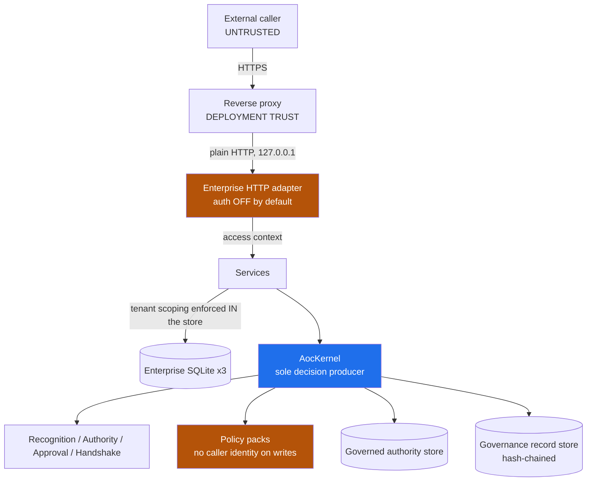
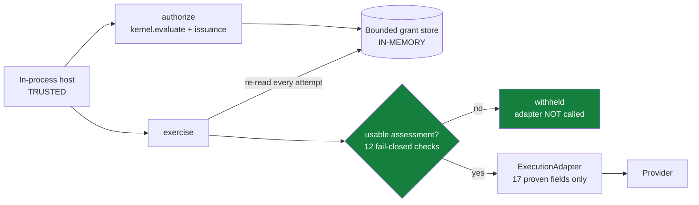
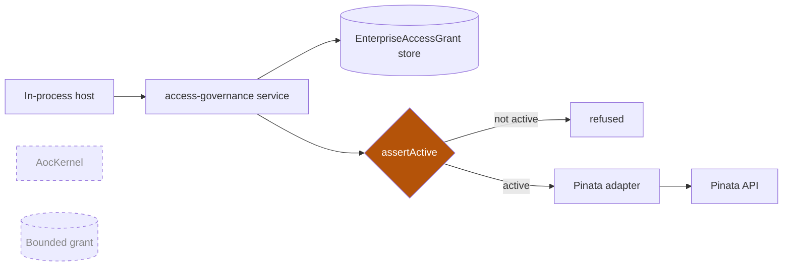
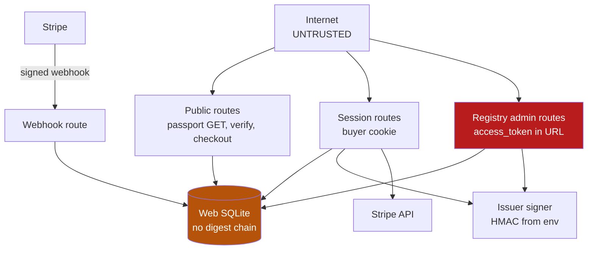
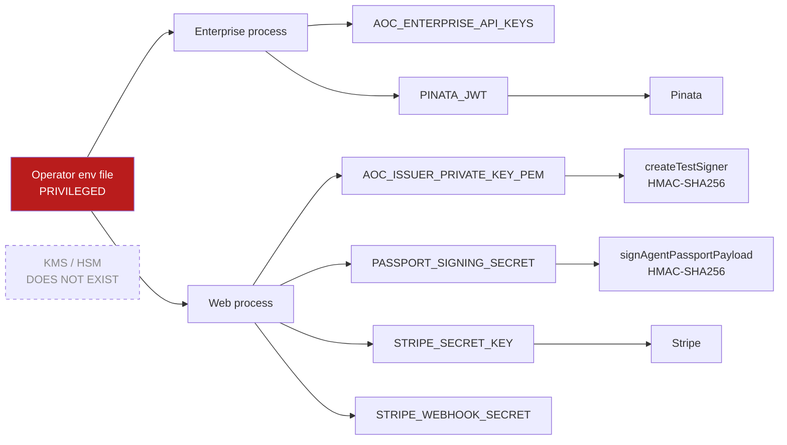

# Frontera Trust Boundaries and Privileged Assets

- Status: canonical. Produced by Prompt 2 of the Security & Containment Architecture track.
- Base: `main` @ `c1d24e2`, with Prompt 0 (`SECURITY_CONTAINMENT_BASELINE_AUDIT.md`) and Prompt 1 (`docs/security/SECURITY_INVARIANTS.md`) present.
- Method: repository-backed. Every row cites code, a test, or a configuration file. Nothing is inferred from a module name.
- **Superseded in part by Prompt 4.** `docs/security/AUTHORITATIVE_GRANT_STORE.md` is now canonical for D-06, D-06a and A-01 — how bounded grants and revocations are persisted, what that guarantees, and where it stops. The rows below are updated in place and point there.
- **Superseded in part by Prompt 3.** `docs/security/NO_BYPASS_AUTHORITY_CONTROLLED_EXECUTION.md` is now canonical for the effect-path inventory and for what authorizes each effect. It corrects two statements here — §8 Path D named one separate provider authority model where there are two (NB-003), and §11 classified store-layer tenant scoping as a hard chokepoint where it is a deployment one (NB-005) — and both corrections are applied in place below. §17 is consumed; its resolution is recorded at §17.7.

---

## 1. Purpose

Prompt 1 answered *"what does Frontera guarantee, and where does each guarantee stop?"*

This document answers the questions that must be settled before Prompt 3 can attempt a no-bypass proof:

- What trusts what?
- What can exercise authority?
- What can mutate authority?
- What holds privileged material?
- What can produce an external effect?
- What crosses from untrusted to trusted?
- What happens if each trusted component is compromised?

It is architecture and threat-model work. It redesigns nothing, implements no containment, and converges no authority path.

---

## 2. Relationship to Security Invariants

`docs/security/SECURITY_INVARIANTS.md` is authoritative for **what is guaranteed and at what scope**. This document does not duplicate it and does not restate its rows.

Where a boundary or asset here is protected by a named invariant, it cites the id (`SEC-INV-nnn`, `SEC-TRUST-nnn`) rather than repeating the guarantee. §14 carries forward `SEC-TRUST-001…007` and refines them; it does not contradict them.

Relationship to `docs/security/THREAT_MODEL_V1.md`: that document threat-models the Enterprise Host and excludes `apps/` and `packages/` (§9). This document maps the **whole repository**. It maps `apps/agent-passport-web` (§10) so that the dedicated audit inserted after this prompt starts from a complete surface inventory — it does not itself threat-model that application.

---

## 3. Trust Vocabulary

Six levels, used consistently and not subdivided further.

| Level | Meaning |
|---|---|
| **UNTRUSTED** | Caller- or attacker-controlled input. Nothing may be believed without validation. |
| **CONDITIONALLY TRUSTED** | Trusted only after authentication or validation, or only under a stated contract. |
| **TRUSTED APPLICATION COMPONENT** | Part of Frontera's current Trusted Computing Base. Compromise is assumed fatal to the guarantees that depend on it. |
| **PRIVILEGED** | Can mutate authority, credentials, policy, signing state, or protected persistent state. |
| **EXTERNAL TRUST DEPENDENCY** | Third-party infrastructure relied upon but outside Frontera's control. |
| **DEPLOYMENT TRUST** | Security depends on operator, cloud, or runtime configuration that this repository cannot enforce. |

One term is used precisely throughout and is worth stating once: a **trust boundary is not a module boundary.** Most module boundaries in this repository are not trust boundaries; a few non-obvious places (the executor closure, `process.env`, the composition root) are.

---

## 4. Trust Domains

Every distinct trust domain found in the repository. "Conceptual" marks a domain the architecture discusses but does not implement.

| # | Domain | Level | Where | Notes |
|---|---|---|---|---|
| D-01 | External caller / client | UNTRUSTED | over HTTP | Reaches D-02 and D-14 only |
| D-02 | Enterprise HTTP host | CONDITIONALLY TRUSTED → TRUSTED | `src/enterprise/adapters/node-http-adapter.ts`, `host/enterprise-server.ts` | 8 route families; auth **off by default** |
| D-03 | Kernel (decision producer) | TRUSTED APPLICATION COMPONENT | `src/kernel/**` | Imports only `crypto`; no I/O (`security-invariants.test.ts`) |
| D-04 | Governance / evaluation pipeline | TRUSTED | `src/features/action-enforcement/**`, recognition, approval, handshake, policy-pack runtimes | Reached transitively via the `RecognitionProvider` |
| D-05 | Bounded-grant runtime | TRUSTED | `src/features/grant-runtime/**`, `src/features/execution-runtime/**` | Layer E + the exercise gate |
| D-06 | Authoritative grant store | PRIVILEGED | `BoundedGrantStorePort`; two implementations — `createSqliteBoundedGrantStore` (`src/enterprise/bounded-grant-store/`) and `createInMemoryBoundedGrantStore` | **Updated by Prompt 4.** Durable when `persistence.provider === 'sqlite'`, in-memory otherwise (SEC-TRUST-003). Integrity verified fail-closed on every authoritative read, with **unkeyed** digests (GS-001) |
| D-06a | Bounded-grant database file + its backups | PRIVILEGED — **outside application control** | `boundedGrant.sqlitePath`, default `.data/bounded-grants.sqlite` | **New in Prompt 4.** Anyone with filesystem write access can replace records or roll the store back; no application check prevents it (D-GS1, R-GS-03). Restoring a snapshot taken before a revocation restores revoked authority, with every integrity check passing (GS-002) |
| D-07 | Governed-authority store | PRIVILEGED | `src/enterprise/authority-governance/sqlite-authority-store.ts` | Digest verified fail-closed on read |
| D-08 | Governance record store | PRIVILEGED | `src/enterprise/governance-store/**` | Append-only interface, hash-chained |
| D-09 | Recognition state | PRIVILEGED | `src/features/recognition-runtime/services/capability-token-service.ts:47` | In-process `Map`; **not durable** |
| D-10 | Policy registry / policy authority | PRIVILEGED | `src/features/domain-policy-pack-runtime/services/policy-pack-registry.ts` | Write methods carry **no caller identity** |
| D-11 | Execution adapter | TRUSTED (by contract) | `ExecutionAdapter` implementations | Port constrains data, not adapter conduct (SEC-TRUST-006) |
| D-12 | Sovereign Access provider path | PRIVILEGED | `src/enterprise/access-governance/**` | Separate authority model (SEC-INV-019) |
| D-13 | Provider APIs (Pinata, Stripe) | EXTERNAL TRUST DEPENDENCY | `packages/pinata-adapter`, `apps/.../stripe-billing-service.ts` | |
| D-14 | Agent Passport web application | TRUSTED (separate TCB) | `apps/agent-passport-web/**` | Own persistence, own secrets, own authz — see §10 |
| D-15 | Passport issuer | PRIVILEGED | `apps/agent-passport-web/src/lib/issuer/issuer-signer.ts` | HMAC via `createTestSigner` (SC-004) |
| D-16 | Stripe integration | EXTERNAL TRUST DEPENDENCY | webhook in, API out | Inbound signature-verified |
| D-17 | Environment / configuration | DEPLOYMENT TRUST / PRIVILEGED | `process.env`, `loadEnterpriseConfiguration` | Sole source of every secret |
| D-18 | Filesystem / SQLite persistence | PRIVILEGED | 13 stores in `src/enterprise`, 1 in `apps/` | Tamper is detectable, not preventable |
| D-19 | Operator / admin | PRIVILEGED (root of trust) | composition root, provisioning service, env file | SEC-TRUST-001 |
| D-20 | Deployment host | DEPLOYMENT TRUST | `docs/operations/DEPLOYMENT_GUIDE_V1.md` | `infrastructure/` is empty (`.gitkeep` only) |
| D-21 | CI / build system | PRIVILEGED (supply chain) | `.github/workflows/{ci,publishability}.yml`, `scripts/**` (42 `.mjs`) | **No secrets used; no `permissions:` declared** — see TB-007 |
| D-22 | Runtime agent / actor surface | **CONCEPTUAL ONLY** | — | **No agent execution runtime exists.** `enforceAgentRuntimeGuard` returns booleans and withholds nothing (`packages/agent-governance/src/runtime-guard/runtime-guard.ts:246-270`); its only non-demo callers are proof pages. Frontera governs *declarations*, not execution. |

D-22 is the load-bearing entry in this table. Every containment question in later prompts reduces to the fact that it is conceptual.

---

## 5. Trusted Computing Base

### 5.1 Application TCB

Must remain uncompromised for Frontera's current authorization guarantees to hold.

| Component | Why it is in the TCB |
|---|---|
| `src/kernel/**` | Sole decision producer (SEC-INV-001) |
| `src/features/action-enforcement/**` + recognition / approval / handshake / policy-pack runtimes | Produce the decision the Kernel concludes |
| `src/features/grant-runtime/**`, `src/features/execution-runtime/**` | Issue and gate bounded grants |
| `src/enterprise/composition/composition-root.ts` | Chooses every provider, store and adapter wired in |
| `src/enterprise/**` stores | Hold authoritative state and enforce tenant scoping |
| `ExecutionAdapter` implementations | Trusted to do only what the validated action says |
| `PolicyPackRegistry` | Holds the rules decisions are made under |
| The host process itself | Holds every secret in memory |

### 5.2 Deployment TCB

Outside this repository's control; the guarantees assume these are correct.

Host OS and kernel · process user and filesystem permissions · the environment/secret file · TLS termination and reverse proxy · ingress restriction · the data volume · backup storage · time source (expiry is evaluated against an injected clock, ultimately the host's).

### 5.3 External Trust Dependencies

| Dependency | Trusted for | Not trusted for |
|---|---|---|
| Stripe | Webhook authenticity (signature-verified), billing truth | Nothing else |
| Pinata / IPFS | Storage and temporary-credential minting | Authorization decisions |
| `better-sqlite3` | Correct, durable, atomic storage | — |
| `@aoc/protocol` | Contract shapes; pinned by commit + checksum in `protocol-consumer.lock.json` | Runtime behaviour |
| GitHub Actions | Build and test integrity | — (no secrets are exposed to it) |
| npm registry | Dependency integrity via lockfile pinning | — |

Cloud infrastructure is **not** assumed hardened. `infrastructure/terraform`, `infrastructure/docker` and `infrastructure/kubernetes` contain only `.gitkeep`; there is no infrastructure-as-code in this repository.

---

## 6. Privileged Asset Inventory

| Asset | Location | Holder | Writer | Reader | Impact if compromised |
|---|---|---|---|---|---|
| **A-01** Bounded grants + revocations | SQLite when configured, otherwise in-memory | D-06 (file: D-06a) | `GrantIssuanceService`, `revokeGrant` | exercise gate | Forge execution authority. **Updated by Prompt 4:** revocations are now first-class, integrity-protected authority state rather than an undigested `Map` entry, and a revocation cannot be the half lost to a crash or restart (SEC-INV-035/036/037). Snapshot rollback remains unaddressed (GS-002) |
| **A-02** Governed authority / reservations / encumbrances | SQLite | D-07 | authority-store transitions | Kernel authority step | Fabricate the authority an action draws on |
| **A-03** Governance records + hash chain | SQLite | D-08 | evaluate commit | read service, evidence | Destroy verifiable-governance claim |
| **A-04** Recognition capability tokens | in-process `Map` | D-09 | `revokeCapabilityToken`, `suspendCapabilityToken` | recognition verifier | Revocation not durable; restart may resurrect authority |
| **A-05** Policy packs | in-process store | D-10 | `savePack`/`saveVersion`/`activatePolicyPackVersion` | policy preflight | Rewrite the rules decisions are made under |
| **A-06** Approval state | in-process | D-04 | `ApprovalRuntime` | approval policy | Bypass required approvals |
| **A-07** Agent passports + event chains | SQLite | D-08/D-14 | **HTTP-reachable** lifecycle routes | verify, views | Forge agent standing |
| **A-08** Assurance assessments / frameworks | SQLite | D-08 | HTTP assessments, reviews, signals | eligibility | Fabricate compliance posture |
| **A-09** Evidence bundles | SQLite | D-08 | build | third parties | Mislead relying parties |
| **A-10** `emergencyDeny` flag (Action Enforcement path) | instance field | D-04 | `setEmergencyDeny` | preflight only | Stop-everything is process-local and invisible to the exercise path. **Unchanged by Prompt 4** |
| **A-27** Emergency controls (bounded-grant path) | SQLite when `persistence.provider === 'sqlite'`, otherwise in-process | D-06 (file: its own, never shared with A-01 or A-03) | `EmergencyControlStorePort.activate` / `release`, operator-only | orchestrator admission, grant commit guard, exercise gate, adapter registry — all through a **reader** port that declares no mutation | Clearing or deleting a control silently re-enables execution the operator believed stopped. The record digest covers the `active` flag, so a flipped flag reads `unavailable` (which withholds) rather than `clear`; it cannot detect a **deleted** row, and cannot stop a re-sealing writer (SEC-TRUST-002, GS-001). Setting a control cannot permit anything |
| **A-28** Exercise-control reservations (P7, bounded-grant path) | SQLite at `exerciseLedger.sqlitePath` — always durable when composed — or a host-supplied ledger | D-06 (file: its own, never shared with A-01, A-03 or A-27) | `ExerciseControlGate` only: `reserve` / `settle` / `release`, reachable solely inside the exercise gate (EP-051 … EP-053) | the same gate, inside its admission transaction | Deleting or re-sealing reservations returns spent aggregate capacity — more effects than the host's limits allow. Row, rule, terminal-event and bucket-head digests make an un-resealed edit or a partial deletion fail closed — every reservation a bucket names is verified before the rolling window is applied, so a rule row's timestamp moved backwards cannot hide it; they cannot stop a writer who re-seals every relevant digest consistently (SEC-TRUST-002). The reservation instant is the ledger's own, sampled inside the admission transaction. Reserving can only withhold |
| **A-29** Canonical authority event stream (P8, governed-action lifecycle) | SQLite at `authorityEventStream.sqlitePath` under `persistence.provider = 'sqlite'`, process-local otherwise, or a host-supplied store | D-06 (file: its own, never shared with A-01, A-03, A-27 or A-28) | The projector only, through the write-only `AuthorityEventRecorder` (orchestrator, ACE revocation) and the gate's `ExerciseControlObserver` — both `void`, enqueue-only, never awaited; appends only, after each fact is established | the store, inside one `BEGIN IMMEDIATE` append | **Evidence, not authority** — nothing that decides reads it (SEC-INV-080), so deleting, forging or re-sealing events changes no authorization, grant, consumption or effect; it falsifies the audit account instead. Chained event digests, a sealed head and id re-derivation make an un-resealed edit, insertion, deletion or head drift fail verification; a writer who rewrites and re-seals a whole stream is not detected (SEC-TRUST-002). A projection that fails, or whose asynchronous append never settles, changes no domain outcome, and authority control flow never awaits durable projection (SEC-INV-081, SEC-INV-088). It is not latency isolation: projection shares this process and event loop, so synchronous or slow store work may add process latency |
| **A-30** Durable execution outcomes (P11, governed-action lifecycle) | SQLite at `executionOutcome.sqlitePath` under `persistence.provider = 'sqlite'`, process-local otherwise, or a host-supplied store | D-06 (file: its own, never shared with A-01, A-03, A-27, A-28 or A-29) | The Governed Action Orchestrator only, through the narrow prepare / record / read port: an attempt before the write-ahead claim, one initial observation after the runtime returned | the store, inside one `BEGIN IMMEDIATE` transaction per write | **Execution fact, not authority** — nothing that decides, issues, admits, reserves or routes reads it (SEC-INV-110); its one behavioural read is the replay of an execution identity the claim already records, which never invokes an adapter (SEC-INV-108). Forging a record could mislead that replay's *answer* (never cause an effect); digests over the closed contract make an un-resealed edit fail verification, and a record that fails is replayed as `…_ALREADY_ATTEMPTED`, never as success (SEC-INV-109); a writer who rewrites a row and its digest consistently is not detected (P20). Deleting it leaves claimed executions unresolved, never retried |
| **A-11** Sovereign Access grants + revocations | SQLite | D-12 | access-governance service | credential mint | Mint provider credentials |
| **A-12** `AOC_ENTERPRISE_API_KEYS` | env | D-17 | operator | HTTP auth | Full API; unscoped key ⇒ cross-tenant |
| **A-13** `AOC_ISSUER_PRIVATE_KEY_PEM` (an HMAC secret) | env | D-17 | operator | D-15 | Forge any Agent Passport |
| **A-14** `PASSPORT_SIGNING_SECRET` | env | D-17 | operator | `passport-issuer.ts` | Forge passport payload signatures — a *second* scheme |
| **A-15** `STRIPE_SECRET_KEY` | env | D-17 | operator | billing service | Money |
| **A-16** `STRIPE_WEBHOOK_SECRET` | env | D-17 | operator | webhook route | Forge billing events ⇒ forge entitlements |
| **A-17** `PINATA_JWT` | env | D-17 | operator | Pinata client | Direct provider access, bypassing every gate |
| **A-18** Registry admin access token | SQLite (SHA-256) | D-14 | rotate / recovery | admin routes + page | Full registry admin, permanently — TB-001 |
| **A-19** Registry recovery code | SQLite (SHA-256) | D-14 | recovery | recovery route | Registry takeover; single-use |
| **A-20** Buyer session tokens | SQLite (SHA-256) | D-14 | login | session check | Account takeover, bounded by role |
| **A-21** Buyer password hashes | SQLite (scrypt) | D-14 | signup | login | Offline cracking — correctly built |
| **A-22** Web app SQLite file | filesystem | D-18 | all web writes | all web reads | Holds A-18…A-21; **no digest chain, no integrity check** — TB-008 |
| **A-23** Enterprise SQLite files (3) | filesystem | D-18 | stores | stores | Tamper detectable on `verify`, not on `get` |
| **A-24** Composition root | code | D-19 | build | startup | Chooses every provider — a swapped store is undetectable at runtime |
| **A-25** Release manifest + pinned checksums | `release/RELEASE_MANIFEST.json` | D-21 | release process | `check-release-integrity` | Supply-chain anchor; `dist/src/index.js` is pinned by SHA-256 |
| **A-26** CI workflows | `.github/workflows/**` | D-21 | repo writers | GitHub | Build/test integrity; see TB-007 |

Public keys are not treated as secrets. `AOC_ISSUER_PUBLIC_KEY_PEM` is called out separately in §9 because, under an HMAC scheme, it is **metadata that cannot verify anything** — a trust-anchor shaped value with no trust-anchor function.

---

## 7. Authority-Write Map

Every production path that creates, changes, narrows, revokes or extends authority-bearing state. Per Step 4, each store is assessed on its own evidence; nothing is generalized from another.

| Writer | Mutates | Caller authn/authz | Externally reachable? | Durable? | Audit | If compromised |
|---|---|---|---|---|---|---|
| `GrantIssuanceService.issueGrant` | A-01 | In-process host only; commit guard re-proves eligibility inside the store transaction (SEC-INV-016) | **No route** (SEC-INV-027) | **Yes when the durable store is configured**, otherwise no | Grant carries `sourceDigest`, correlation; the persisted record carries its own envelope digest | Mint arbitrary bounded grants |
| `AuthorityControlledExecutionService.revokeGrant` | A-01 | In-process host only | **No route** | **Yes when the durable store is configured**, at durability equal to the grant's by construction (SEC-INV-035) | Integrity-protected revocation record, cross-referenced from the grant row | Suppress revocation — now requires rewriting **both** records consistently (SEC-INV-037), which an unkeyed digest still permits (GS-001) |
| Governed-authority transitions | A-02 | In-process; capacity conservation + digest re-seal inside the store transaction | **No route** | Yes | Chained `transition_digest` | Fabricate authority positions |
| `KernelAuthorityProvisioningService` | A-02 (durable) | Requires `context.system === true` **and** an operator context (`provisioning-service.ts:51-60`) | **No route** — operator surface | Yes | Append-only event chain, terminal revocation | Enrol arbitrary actors |
| `PolicyPackRegistry.savePack` / `saveVersion` / `activatePolicyPackVersion` | A-05 | **None. No caller identity parameter exists** (`policy-pack-registry.ts:81,121,129`) | **No route** — protected only by not being exposed | In-process | Activation event | Rewrite decision rules |
| `capability-token-service.revoke/suspend` | A-04 | In-process | **No route** | **No** | — | Restore revoked recognition |
| `ApprovalRuntime` state changes | A-06 | In-process | **No route** | In-process | Approval records | Forge approvals |
| **Passport lifecycle** — issue / activate / suspend / reactivate / revoke / retire | A-07 | **HTTP, authenticated, tenant-scoped** (`node-http-adapter.ts:339,377-402`) | **YES** | Yes | Chained, contiguous event log | Forge agent standing within one tenant |
| **Assurance** — assessments / manual reviews / signals | A-08 | **HTTP, authenticated, tenant-scoped** (`:231,298,306`) | **YES** | Yes | Digest-sealed, append-only, attributable | Shift assurance outcomes within one tenant |
| Sovereign Access grant lifecycle | A-11 | In-process; `assertActive` on use | **No route** | Yes | Revocation + enforcement records | Mint provider credentials |
| `setEmergencyDeny` | A-10 | In-process, no identity | **No route** | **No** | Control-plane metric only | Disable or fake the stop switch on the Action Enforcement path |
| `EmergencyControlStorePort.activate` / `release` | A-27 | In-process operator surface (`AocEnterprise.emergencyControlAdministration`); an `issuerRef` is **recorded, not checked** | **No route**, no SDK method, no intent field | **Yes when `persistence.provider === 'sqlite'`**, otherwise no | Each control row carries its declaring `issuerRef`, instant and record digest | `release` re-enables execution on the bounded-grant path. `activate` can only withhold. The execution path is typed against the reader, so it cannot disable the interlock that governs it (SEC-INV-051) |
| `ExerciseControlLedgerPort.reserve` / `settle` / `release` (P7) | A-28 | In-process, and only from `GrantExecutionService` through `ExerciseControlGate` after the grant gate; adapters, policies, resolvers and the Governed Action layer never hold it (`structural-boundaries.test.ts`) | **No route**, no SDK method, no intent field — every P7 name is a rejected intent field and a reserved `assertedContext` key (SEC-INV-078) | **Yes** — the SQLite ledger is always durable | Immutable reservation, rule and terminal-event rows; sealed bucket heads | `release` returns capacity; `reserve` and `settle` can only restrict. A host holding its own ledger reference can write it freely — host code is trusted |
| Exercise-control policy and exercise-time binding resolver (P7) | A-28 | **Trusted host code**, composed at startup; synchronous; answers validated every time | **No route** | n/a | — | A too-generous *valid* policy, or a resolver that always answers the issuance binding, weakens P7 to the host's intent — they are trusted dependencies, not verified ones |
| `AuthorityEventStreamWriter.append` via the projector (P8) | A-29 | In-process only, and **outside authority control flow**: the orchestrator and ACE hand facts to the write-only recorder, the exercise-control gate to its observer, and the projector appends them afterwards from its own queue (grant intake → per-stream append). No authority path awaits an append; the work still shares this process and event loop, so a synchronous or slow store can add latency (SEC-INV-088). A host-supplied store is trusted host code | **No route**, no SDK method, no intent field; the read surface `AocEnterprise.authorityEventStream` is read-only and tenant-scoped | **Yes** under SQLite persistence | Chained event digests, sealed per-stream head, deterministic ids re-derived on verification, append-only triggers | Nothing — it is evidence. A host that appends fabricated events to its own store falsifies the audit account; it cannot change what any path authorizes |

**The correction this table forces.** It is accurate to say *grant* authority-write surfaces are not caller-exposed (SEC-INV-027). It is **not** accurate to generalize that to all authoritative state: passport lifecycle and assurance writes are deliberately HTTP-reachable, authenticated and tenant-scoped. Both are append-only and attributable, which is the mitigation — not inaccessibility.

---

## 8. Effect-Capability Map

```
ENTRY PRINCIPAL -> TRUST BOUNDARY -> AUTHORIZATION/VALIDATION -> EFFECT-CAPABLE COMPONENT -> EXTERNAL/PRIVILEGED RESOURCE
```

**Path A — Evaluation only**
`External caller → HTTP adapter → API key + shape validation → AocKernel.evaluate() → Governance Store (local durable write)`
Classification: **AUTHORITY-GATED.** Produces no external effect (SEC-INV-008).

**Path B — `AocKernel.enforce()` opaque executor**
`In-process host → (no boundary; a function argument) → decision over the declared ActionDescriptor → caller-supplied closure → anything the process can reach`
Classification: **PARTIALLY AUTHORITY-GATED.** Decision-time only; the effect is not bound to the declaration (SEC-INV-009/010).

**Path C — Bounded-grant exercise**
`In-process host → GrantExecutionService → authoritative re-read + 12 fail-closed checks → ExecutionAdapter (17 proven fields) → provider`
Classification: **AUTHORITY-GATED.** The strongest path (SEC-INV-011…015).

**Path D — Sovereign Access provider**
`In-process host → access-governance service → EnterpriseAccessGrant store read + assertActive → Pinata adapter → Pinata API`
Classification: **PARTIALLY AUTHORITY-GATED** — real, but a *different* model; not the Kernel, not a bounded grant (SEC-INV-019).

**Path D2 — Content Protection provider** *(added by Prompt 3; missing from this map as first written)*
`In-process host → ContentProtectionService.protectResource → requireContentProtectionAccessToOrganization (caller-asserted tenant scope) → ContentStoragePort → Pinata adapter → Pinata API`
Classification: **PARTIALLY AUTHORITY-GATED** — a **second**, independent provider authority model reaching the same resource as Path D, with **no grant of any kind**. See `NO_BYPASS_AUTHORITY_CONTROLLED_EXECUTION.md` EP-018 and NB-003.

**Path E — Agent Passport web routes**
`Internet → Next.js route → session cookie / registry admin token / role check → repositories, issuer signer, Stripe client → SQLite, Stripe`
Classification: **APP-LEVEL AUTHENTICATED.** Governed by the application's own authorization, **not by Frontera authority** at any point.

**Path F — Stripe calls**
Outbound: `web app → STRIPE_SECRET_KEY → Stripe API`. Inbound: `Stripe → webhook → signature verification → entitlement writes`.
Classification: outbound **TRUSTED-IN-PROCESS**; inbound **APP-LEVEL AUTHENTICATED** (cryptographically, and correctly).

**Path G — Additional effect paths found**
- Filesystem: `existsSync`/`mkdirSync` in 13 SQLite store modules; paths come from boot configuration, never from a request. **TRUSTED-IN-PROCESS.**
- Operator tooling: `scripts/portability/backup-enterprise-v1.mjs` / `restore-enterprise-v1.mjs` — full read/write over the data directory. **DEPLOYMENT-GATED.**
- `packages/control-plane/store.ts`, `packages/commercial-demo/src/cli.ts` — file writes. **Non-production.**
- Raw provider seam: `createPinataProviderClient({ jwt })` constructs a `PinataSDK` directly and is what Paths D and D2 both sit on. Possession of `PINATA_JWT` is sufficient. **TRUSTED-IN-PROCESS** (`NO_BYPASS_AUTHORITY_CONTROLLED_EXECUTION.md` EP-020).
- **No** shell, child process, `eval`, or `new Function` exists in production TypeScript anywhere in the repository. Six `await import(...)` calls exist in `apps/agent-passport-web`, **all with constant string specifiers** and none caller-influenced — corrected from "no dynamic `import()`" as first written here.

Application authentication is **not** Frontera authority governance. Paths E and F are authenticated and entirely ungoverned by the Kernel.

---

## 9. Secret Flow Map

For each production secret: origin → loading → process → residency → consumers → outbound use → exposure → rotation.

| Secret | Origin | Loading | Process | Residency | Consumers | Outbound use | Log/persist exposure | Rotation |
|---|---|---|---|---|---|---|---|---|
| `AOC_ENTERPRISE_API_KEYS` | operator env file | `loadEnterpriseConfiguration(env)` once at boot | Enterprise host | **PROCESS-RESIDENT, LONG-LIVED** | HTTP auth via `getInternalEnterpriseConfiguration` | none | Excluded from `PublicEnterpriseConfiguration` by type; 5 structural tests | Restart only |
| `AOC_ISSUER_PRIVATE_KEY_PEM` | operator env | `getIssuerSignerConfigFromEnv()` per call | Web app | **PROCESS-RESIDENT, LONG-LIVED** | `createTestSigner` as the HMAC secret | none | Not logged | Restart only |
| `AOC_ISSUER_PUBLIC_KEY_PEM` | operator env | same | Web app | process-resident | Registered into `SqliteIssuerKeyRepository` as issuer key metadata | none | **Persisted to DB as a "public key"** | — |
| `PASSPORT_SIGNING_SECRET` | operator env | `getPassportIssuerConfig()`, cached in a module-level variable | Web app | **PROCESS-RESIDENT, LONG-LIVED** | `signAgentPassportPayload` / `verifyAgentPassportPayload` | none | Not logged | Restart only (cache must also clear) |
| `STRIPE_SECRET_KEY` | operator env | read at client construction | Web app | **PROCESS-RESIDENT, LONG-LIVED** | Stripe SDK | **Yes — to Stripe** | Not logged | Restart only |
| `STRIPE_WEBHOOK_SECRET` | operator env | read per request | Web app | **PROCESS-RESIDENT, LONG-LIVED** | `stripe.webhooks.constructEvent` | none | Not logged | Restart only |
| `PINATA_JWT` | operator env | passed to `new PinataSDK({ pinataJwt })` | Enterprise host | **PROCESS-RESIDENT, LONG-LIVED** | Pinata SDK | **Yes — to Pinata** | Documented "never logged, never echoed" | Restart only |
| `AOC_DEV_SIGNING_SECRET` | env, with a checked-in literal fallback | `createDevSigner()` | — | **dead code, zero call sites** | — | — | — | — |

Every production secret is **PROCESS-RESIDENT** and **LONG-LIVED**. None is EXTERNALLY HELD or EPHEMERAL. **No KMS or HSM exists anywhere in this repository** — zero occurrences in `src/`, `packages/`, `apps/`, or `docs/operations`. `src/runtime/vault/` is not one (§16, TB-004).

The one asymmetry worth naming: `AOC_ISSUER_PUBLIC_KEY_PEM` is stored as an issuer *public key* with `metadata: { signerBoundary: 'server-side-env' }`, but the algorithm is `hmac-sha256`. Under a symmetric scheme that value verifies nothing, and the value that *would* verify is the secret itself. It is a trust-anchor-shaped field with no trust-anchor function.

---

## 10. Agent Passport Web Surface

`apps/agent-passport-web` is production-shaped and was outside every existing security artifact (SC-006). This section establishes the surface inventory the dedicated audit needs. **It is not that audit.**

> **Superseded in part by Prompt 2.5.** The dedicated threat model is now `docs/security/AGENT_PASSPORT_WEB_THREAT_MODEL.md`. It corrects two facts stated here and in the Prompt 2 result: this application exposes **no passport lifecycle transition routes** (only issuance; `updatePassportStatus`/`revokePassport` have zero production callers), and it contains **no assurance surface at all**. Both belong to `src/enterprise`. The endpoint count is 31 route files / **35 method+path endpoints**. TB-001, TB-002 and TB-008 are confirmed there as APW-002 and APW-006, and remain open. One finding from that model, APW-001 (an unauthenticated checkout route that created a registry and disclosed its admin credential and recovery code), was remediated in Prompt 2.6; TB-001 and TB-002 were not.

### 10.1 Externally reachable routes (31)

| Group | Routes | Authentication | Notes |
|---|---|---|---|
| Account | `signup`, `login`, `logout`, `me`, `registries`, `billing`, `claim-registry` | Buyer session cookie (`aoc_buyer_account_session`); `signup`/`login` unauthenticated by nature | — |
| Organization registry | 14 routes under `[registryId]` — profile, passports, team, invitations, exports, billing, admin-session, admin-access/rotate, enrollment-access | Registry admin token **or** admin session **or** account role | Two disjoint models — TB-002 |
| Registry recovery | `organization-registry/recover` | Recovery code + contact email, **or** Stripe session + email | Single-use; rotates the admin token |
| Agent passports | `POST /api/agent-passports` | `access_token` in body | Enrolment |
| | `GET /api/agent-passports/[id]`, `GET .../verify` | **None — public** | Public verification is the intended product behaviour; it also means passport records are world-readable by id |
| Checkout | `POST /api/checkout/session`, `GET .../[sessionId]` | **None — public** | Creates a Stripe checkout session |
| Stripe webhook | `POST /api/stripe/webhook` | Stripe signature over the raw body | Correct |
| Team invitations | `[invitationId]`, `accept`, `revoke` | Session required (401) + invitation token | — |

### 10.2 Privileged operations available

Issuer signing (`createIssuerSignerFromEnv` at four call sites in `passport-adapter.ts`) · passport enrolment and issuance · registry admin token rotation · recovery-code redemption · team membership and role changes · export generation and download · Stripe checkout and billing-portal creation · entitlement writes driven by webhook events.

### 10.3 Trust placed in each mechanism

| Mechanism | Trusted for | Strength |
|---|---|---|
| Buyer session cookie | Account identity | 256-bit random, SHA-256 at rest, `HttpOnly`/`SameSite=Lax`/`Secure` in production, 30-day expiry, individually and bulk revocable. **Sound.** |
| Buyer password | Account authentication | scrypt (N=16384, r=8, p=1, 16-byte salt, 64-byte key) + `timingSafeEqual`. **Sound.** |
| Registry admin token | Full registry administration | 256-bit random, `timingSafeEqual` comparison — but **permanent and carried in URLs**. TB-001. |
| Registry role model | Scoped registry actions | Five roles, eleven permissions — **bypassed entirely by the token path**. TB-002. |
| Recovery code | Registry takeover | 64-bit, single-use, rotates the admin token. Adequate as built. |
| Stripe webhook signature | Billing truth | `constructEvent`; fails closed when the secret is unset; replay-blocked by `UNIQUE(stripe_event_id)`. **Sound.** |

### 10.4 Persistence and tenancy

One SQLite file (`AOC_AGENT_PASSPORT_DB_PATH`, default `.data/agent-passport.sqlite`). Prepared statements throughout. **No digest chain, no integrity verification, no append-only discipline** — unlike every store in `src/enterprise`. Tenancy is per-registry, enforced per route rather than at a store layer; there is no equivalent of `canSeeRecord`. TB-008.

---

## 11. Security Chokepoints

| Chokepoint | Classification | Why |
|---|---|---|
| Enterprise HTTP authentication | **DEPLOYMENT CHOKEPOINT** | Real and constant-time, but **off by default** (`AOC_ENTERPRISE_REQUIRE_AUTH` default `false`) |
| Store-layer tenant scoping | **DEPLOYMENT CHOKEPOINT** *(corrected by Prompt 3, NB-005)* | Enforced inside the stores, and a bypassed adapter still cannot cross tenants **once the caller is organization-scoped**. But `resolveGovernanceAccessContext` returns `{ system: true }` whenever `AOC_ENTERPRISE_REQUIRE_AUTH` is false — the default — and every scoping predicate begins `if (context.system) return true;`. The scoping is real; the principal it scopes against is produced by a configuration flag |
| Kernel decision boundary | **HARD CHOKEPOINT** for decisions | Sole decision producer; narrowing-only composition; invariants asserted per call |
| Bounded-grant exercise gate | **HARD CHOKEPOINT within its path** | Single adapter call site, ordered after the gate, test-pinned — but PATH-LOCAL |
| Grant issuance commit guard | **HARD CHOKEPOINT** | Synchronous by type; no `await` can interleave |
| Authoritative store digest check | **HARD CHOKEPOINT against naive tampering**, not against a re-sealing writer | SEC-TRUST-002 |
| Execution adapter port | **VOLUNTARY CHOKEPOINT** | Constrains data crossing it; nothing forces effects through it. Server-side routing does not change this: a host holding a child adapter can call it directly (SEC-TRUST-004, SEC-TRUST-006) |
| Server-side execution adapter routing | **HARD CHOKEPOINT for *which* provider Frontera reaches** | Membership frozen at composition, selector synchronous and host-owned, at most one child per decision, and no caller input selects an adapter (SEC-INV-039 … SEC-INV-042). It decides **where**, never **whether** |
| Sovereign Access `assertActive` | **VOLUNTARY CHOKEPOINT** | Real check, different model, in-process callers only |
| Signer boundary (`AgentPassportSignerPort`) | **VOLUNTARY CHOKEPOINT** | Correctly shaped for KMS, but the secret is in-process today |
| Stripe webhook signature | **HARD CHOKEPOINT** | Cryptographic, fails closed |
| Web app per-route auth | **VOLUNTARY CHOKEPOINT** | Each route decides for itself; no central gate |
| Deployment network boundary | **DEPLOYMENT CHOKEPOINT** | Documented (bind `127.0.0.1`, TLS at proxy); `infrastructure/` is empty |
| Egress control | **FUTURE CHOKEPOINT** | Does not exist (SEC-INV-U03) |
| Process isolation for agents | **FUTURE CHOKEPOINT** | Does not exist (SEC-TRUST-005) |
| Durable operational interlock (bounded-grant path) | **HARD CHOKEPOINT within its path, when composed** | Four checkpoints — admission, the synchronous grant commit guard, effect time after the authoritative grant re-read, and the selected child adapter. Unreadable state withholds (SEC-INV-043 … SEC-INV-052). It is **opt-in**: a deployment that does not compose it gets no checks |
| One durable kill switch across every path | **FUTURE CHOKEPOINT** | The bounded-grant path now has its own (above), but the Action Enforcement path still uses the process-local `emergencyDeny`, and Sovereign Access and Content Protection honour neither. Convergence is SEC-INV-U05's remaining work |

---

## 12. Bypass Primitives

Architectural enumeration. Nothing here was exploited.

| Primitive | Present? | Holder | Boundary crossed | Existing mitigation | Future owner |
|---|---|---|---|---|---|
| Arbitrary executor closure | **Yes** | Any in-process host caller | Decision → effect | Decision-time authorization only (SEC-INV-010) | *Prompt 3: assessed — EP-014, PARTIALLY BOUND, NB-002. SC-003 remains open* |
| Direct network egress | **Yes** | Any code in either process | Process → provider | None | Prompt 11 |
| Direct provider credential access (`process.env`) | **Yes** | Any code in the holding process | Process → secret | Type-level exclusion from the *public composition surface* only | Prompt 9 |
| Authority-store write access | **Yes, in-process** | Composition-root-wired code | Caller → authority | No caller identity on `PolicyPackRegistry`; operator context on Kernel Authority | Prompt 14 |
| Alternate API path (Sovereign Access) | **Yes** | In-process host | Authority model → effect | Its own store read + `assertActive` | *Prompt 3: assessed — EP-015/016/017, EXCEPTED. A **second** such path was found (Content Protection, EP-018, NB-003). SC-002 remains open* |
| Filesystem write to store files | **Yes** | Process user / operator | Software → persistence | Digests + chains detect; `verify` must be run | Prompt 5 |
| Host compromise | **Yes** | Attacker with host access | Everything | None in software | Prompt 17 |
| DB compromise | **Yes** | Anyone with file access | Persistence | Detective only; re-sealing defeats it | Prompt 5 |
| Policy mutation | **Yes, in-process** | Any code holding the registry | Rules | Not exposed; no identity check | Prompt 14 |
| Build/CI compromise | **Yes** | Repo writer, or any GitHub Action | Supply chain | Checksum-pinned release artifacts; lockfile pinning; **no `permissions:` declared** | Prompt 17 |
| Registry admin token capture from a URL | **Yes** | Anyone reading history, logs, or a shared link | Untrusted → registry admin | Constant-time comparison; access events recorded | inserted Agent Passport audit |
| Shell / child process / dynamic code | **No** | — | — | Absent from production TypeScript; four layer modules plus the Kernel ban it structurally | — |
| Customer transaction key theft | **No** | — | — | No such key exists; build-time vocabulary bans (SEC-INV-025) | — |

---

## 13. Compromise Impact Matrix

| Component compromised | Forge authority? | Widen authority? | Execute effect? | Steal secret? | Rewrite evidence? | Blast radius |
|---|---|---|---|---|---|---|
| External caller | No | No | Only what its grant/role permits | No | No | Bounded by authn + tenant scoping |
| Enterprise HTTP host (D-02) | No (decision is downstream) | No | Via authenticated routes only | **Yes — same process** | Passport/assurance appends only | One process, all its secrets |
| Kernel (D-03) | **Yes** | **Yes** | Indirectly, by allowing | No (holds none itself) | No | Every authorization decision |
| Bounded grant store (D-06) | **Yes** | **Yes** | **Yes** | No | No | All grant-gated execution |
| Policy writer (D-10) | No | **Yes** | Indirectly | No | No | Every decision made under that pack |
| ExecutionAdapter (D-11) | No | No | **Yes, unbounded** | Provider credential | No | Whatever the provider permits |
| Frontera process (D-02+D-03+D-06) | **Yes** | **Yes** | **Yes** | **Yes — all env secrets** | **Yes, by re-sealing** | Total for Enterprise |
| Deployment host (D-20) | **Yes** | **Yes** | **Yes** | **Yes** | **Yes** | Total, both processes |
| Agent Passport web (D-14) | **Yes — passports** | Registry scope | **Yes — Stripe, Pinata-free** | **Yes — Stripe + both issuer secrets** | Web DB has no chain | Total for the SaaS surface |
| Passport issuer (D-15) | **Yes — any passport** | No | No | Is the secret | No | Every passport ever verified |
| Stripe integration (D-16) | No | Entitlements | Money movement | Stripe key | Billing records | Revenue + entitlement state |
| CI / build system (D-21) | **Yes, eventually** | **Yes** | **Yes** | No secrets are exposed to CI | **Yes, by shipping a changed artifact** | Every future deployment |

**Compromise isolation that does not exist, stated plainly:** compromising either application process yields *every* environment secret held by that process. There is no secret broker, no per-component scoping, and no process boundary between the code that decides and the code that holds credentials.

---

## 14. Explicit Trust Assumptions

`SEC-TRUST-001…007` from `SECURITY_INVARIANTS.md` are carried forward unchanged in meaning. This prompt refines three of them with evidence found here; none is contradicted.

| Id | Carried forward | Refinement from this prompt |
|---|---|---|
| SEC-TRUST-001 | Host trust / root of trust | Extended: the **CI and build system** (D-21) is also a root of trust. A changed artifact reaches every future deployment, and the release manifest is the only anchor. |
| SEC-TRUST-002 | Privileged writer limit (unkeyed digests) | Confirmed. Additionally: the web app's store (A-22) has **no digest at all**, so the limit there is not "detectable but re-sealable" — it is undetectable. |
| SEC-TRUST-003 | Authoritative state durability | Confirmed for grants and recognition. Extended: `emergencyDeny` (A-10) shares the property. *Updated by Prompt 4:* emergency controls (A-27) are durable **when `persistence.provider === 'sqlite'`** and process-local otherwise — and for a control, being lost on restart fails **open**, which is precisely why the durable store exists and why the in-memory one is never described as durable. |
| SEC-TRUST-004 | Voluntary chokepoint limit | Confirmed and enumerated as §12. |
| SEC-TRUST-005 | Process-isolation absence | Confirmed. D-22 is conceptual: there is no agent runtime to isolate yet. |
| SEC-TRUST-006 | Provider adapter trust | Confirmed. |
| SEC-TRUST-007 | Deployment trust | Confirmed. Extended: `infrastructure/` contains no infrastructure-as-code, so every deployment control is prose. |

**New assumption made explicit by this prompt:**

> **SEC-TRUST-008 — Name honesty is not a security control.** Two modules carry security-suggestive names whose implementations do not match (§16, TB-003/TB-004). Until Prompt 5/6 change what they do, any claim derived from their *names* is unfounded. This assumption exists so that a questionnaire answered from export names cannot accidentally overclaim.

---

## 15. Security Boundary Diagrams

### A. Frontera authorization architecture



### B. Bounded-grant execution path (the strongest path)



**P6 — the Generic HTTP adapter as a provider below this path.** When a deployment composes `executionAdapterRouting.genericHttpAdapters`, the `ExecutionAdapter` above may be a registry child that performs one HTTPS request to one operator-pinned origin (EP-050). Its trust inputs are the `ValidatedExecutionAction` (untrusted-origin data already proven inside a grant bound) and **operator configuration** (trusted: origin, method, mapping, credential). Its privileged asset is the configured provider credential, which is held in process memory, snapshotted at composition, and never emitted into results, records, logs or events. The boundary it adds is application-level destination control for that one adapter — pinned HTTPS origin, per-execution DNS with every answer public-address-checked and the approved IP bound to the socket, TLS verified with `rejectUnauthorized: true` hardcoded (not configurable, immune to `NODE_TLS_REJECT_UNAUTHORIZED=0`), no redirect, retry, proxy or connection reuse. It is **not** a network trust boundary: SEC-TRUST-004 (voluntary chokepoint) and SEC-TRUST-006 (adapter trust) are unchanged, and SEC-INV-U03 remains unimplemented. See `docs/enterprise/AOC_GENERIC_HTTP_EXECUTION_ADAPTER.md`.

### C. Sovereign Access path (separate authority model)



*The Kernel and bounded grants are drawn dashed because this path reaches neither.*

### D. Agent Passport web trust topology



### E. Secret flow / signer topology



*Two independent HMAC schemes sign passport material in the same process. No KMS or HSM exists anywhere in the repository.*

---

## 16. Findings

New findings from this prompt. Where a Prompt 0 finding is confirmed rather than extended, it is referenced, not restated.

### TB-001 — Registry admin credential is permanent and travels in URLs
- **Severity:** HIGH · **Boundary:** untrusted network → registry administration (D-14) · **Asset:** A-18
- **Evidence:** `registry-admin-access.ts:50` reads it from `url.searchParams.get('access_token')`. It is embedded in navigable page URLs returned to users — `api/account/claim-registry/route.ts:46,59`, `api/agent-passports/route.ts:76`, `api/checkout/session/[sessionId]/route.ts:69` — and consumed by the server-rendered page at `app/registry/admin/page.tsx:20,32`. The registry row carries `admin_access_token_created_at`, `_rotated_at`, `_last_used_at` and **no expiry column** (`organization-registry-repository.ts:34-47`).
- **Consequence:** a permanent bearer credential granting full registry administration is written into browser history, bookmarks, shared links, and proxy/CDN access logs. It remains valid until manually rotated.
- **Current mitigation:** comparison is `timingSafeEqual` over a 256-bit token; admin access events are recorded; the admin page loads no external subresource, limiting `Referer` leakage; a rotate endpoint and a single-use recovery path exist; an `aoc_registry_admin_session` cookie path is already implemented alongside it.
- **Owner:** the inserted Agent Passport threat-model prompt.

### TB-002 — The admin-token path bypasses the registry role model
- **Severity:** MEDIUM · **Boundary:** registry principal → registry actions · **Asset:** A-18
- **Evidence:** `registry-role-policy.ts` defines five roles over eleven permissions. `verifyRegistryAdminAccess` returns `{ ok, registryId, via }` — no role — so a token holder is ungated rather than role-scoped.
- **Consequence:** two authorization models over one resource, the weaker one winning. Structurally the same shape as SC-002 in `src/`.
- **Current mitigation:** the token is registry-scoped; access events are recorded.
- **Owner:** the inserted Agent Passport threat-model prompt.

### TB-003 — Two different `verifyCapabilityToken` functions, one of them in the authorization path *(resolves SC-013)*
- **Severity:** MEDIUM · **Boundary:** public API naming → authorization semantics
- **Evidence:** two unrelated functions share the name.
  1. `src/runtime/crypto/verification/capability-verifier.ts:35` — validates a `@aoc/protocol` `CapabilityToken`'s **shape, expiry, and revocation-list membership**, plus proof *shape*. It performs **no cryptographic signature verification** — the protocol's `ProofMetadata` carries no signature bytes and no key. Its `trustDomain` parameter is accepted and **intentionally unused** (`:4-13`). It is exported publicly from `src/index.ts:56` and `src/runtime/crypto/index.ts:7`, and **has no production caller** — only a consumer fixture and tests.
  2. `src/features/recognition-runtime/services/capability-token-service.ts:136` — a different function taking a token **id**, resolving it against an in-process `Map` and checking status and expiry. **This one is in the real authorization path.**
- **Consequence:** a reader, questionnaire, or coding agent resolving "verifyCapabilityToken" may land on the `crypto`-namespaced one and conclude that Frontera cryptographically verifies capability tokens. It does not, on either path.
- **Current mitigation:** the file itself is honest at `:4-13` and `:66-69`; the module is unused by production.
- **Resolution chosen (see §16.1):** documentation + a structural test. **No rename.**
- **Owner:** Prompt 5 (cryptographic authenticity) if real verification is ever added.

### TB-004 — `src/runtime/vault/` is not a vault, and its "attestation" is a string label *(resolves SC-014)*
- **Severity:** MEDIUM · **Boundary:** module naming → assumed key custody
- **Evidence:** the module (124 lines, 7 files) stores no key, encrypts nothing, calls no KMS/HSM, and signs nothing. What it does: `validateRuntimeVaultIsolation` compares `tenantId`/`workspaceId`/`runtimeId`/`trustDomain`/`vaultOwnerId` for drift, and `validateRuntimeVaultBoundary` checks continuity-epoch/version/sequence consistency against a `RuntimePersistenceEnvelope`. `createRuntimeVaultAttestation` is `parts.join(':')` (`runtime-vault-attestation.ts:3`) — **not a hash, not a digest, not a signature**, a delimiter-joined label. `exportVaultBoundary` is `JSON.stringify` and `importVaultBoundary` is `JSON.parse` with an unchecked cast.
- **Consequence:** "vault" and "attestation" are the two words most likely to be read as key custody and cryptographic attestation. Both are absent. Prompt 0 recorded this as "deterministic fingerprints"; they are weaker than that.
- **Current mitigation:** `CURRENT_STATE_SOVEREIGN_RUNTIME_VAULT_BOUNDARY.md` records "Attestation is deterministic but not cryptographically signed yet."
- **Resolution chosen (see §16.2):** documentation + a structural test. **No rename.**
- **Owner:** Prompt 5.

### TB-005 — `importVaultBoundary` performs an unvalidated `JSON.parse` and cast
- **Severity:** LOW · **Boundary:** serialized input → runtime boundary object
- **Evidence:** `runtime-vault-boundary.ts` — `importVaultBoundary(s) { return JSON.parse(s) as RuntimeVaultBoundary; }`. No shape validation; the `as` is a lie to the type system if the input is anything else.
- **Consequence:** any caller that ever feeds untrusted serialized data constructs an arbitrary object typed as a boundary. Today no production path does — `src/runtime/host.ts:136` and the release gate `scripts/check-runtime-vault-boundary.mjs` are the only callers — so this is latent, not live.
- **Current mitigation:** `validateRuntimeVaultBoundary` exists and is applied on `hydrateVaultBoundary`, but not on import.
- **Owner:** whichever prompt makes `src/runtime` a supported ingestion surface; none currently does.

### TB-006 — `verifyDelegatedCapability` performs no delegation-specific verification
- **Severity:** LOW · **Boundary:** public API naming → delegation semantics
- **Evidence:** `delegation-verifier.ts:8` — the entire body is `return verifyCapabilityToken(token, ctx);`. No chain walk, no attenuation check, no parent/child relationship is examined.
- **Consequence:** the name implies delegated-capability verification; the implementation is an alias.
- **Current mitigation:** none; also has no production caller.
- **Owner:** Prompt 5.

### TB-007 — CI workflows declare no `permissions:` block
- **Severity:** LOW · **Boundary:** build system → repository (D-21)
- **Evidence:** neither `.github/workflows/ci.yml` nor `publishability.yml` contains a `permissions:` key, so the default `GITHUB_TOKEN` scope applies to every job and every third-party action they invoke.
- **Consequence:** a compromised action or transitive build dependency runs with more repository scope than the jobs need.
- **Current mitigation, genuinely strong:** the workflows reference **no secrets at all** (`secrets.` appears zero times), so there is nothing beyond the ambient token to exfiltrate. Release artifacts are checksum-pinned in `release/RELEASE_MANIFEST.json`.
- **Owner:** Prompt 17.

### TB-008 — The web application store has no integrity discipline
- **Severity:** MEDIUM · **Boundary:** application → persistence (A-22)
- **Evidence:** `apps/agent-passport-web/src/lib/db.ts` opens one SQLite file; the twelve repositories use prepared statements but no digest, no chain, no append-only constraint, and no `verify` surface. Contrast `src/enterprise`, where every store is digest-bearing and two interfaces structurally forbid update/delete.
- **Consequence:** tampering with A-18…A-21 (admin tokens, recovery codes, sessions, password hashes) or with billing state is **undetectable** — the detective control that SEC-TRUST-002 relies on in `src/enterprise` does not exist here.
- **Current mitigation:** none.
- **Owner:** the inserted Agent Passport threat-model prompt.

### Confirmed from Prompt 0, not restated
SC-001 (auth off by default), SC-002 (Sovereign Access is a separate model — mapped as Path D), SC-003 (`enforce()` effect binding — mapped as Path B), SC-004 (issuer signing), SC-005 (state durability), SC-006 (**closed as an inventory gap by §10**; the threat model itself remains open), SC-009 (kill switch), SC-016 (`infrastructure/` empty).

### Assessed and explicitly not findings
Buyer password storage (scrypt, sound parameters, constant-time) · Stripe webhook ingress (signature-verified, fails closed, replay-protected) · buyer session tokens (256-bit, hashed, `HttpOnly`/`SameSite`/`Secure`, expiring, revocable) · recovery-code entropy (64-bit but single-use and online-only) · public passport read/verify routes (unauthenticated **by product design** — public verifiability is the point).

### 16.1 SC-013 resolution

**What it actually is:** a structural/temporal/revocation-list validator for a protocol token shape, with an accepted-but-unused `trustDomain` parameter and no production caller.

**Remedy chosen: (A) documentation clarification, plus a structural test. No rename, no relocation.**

Renaming was considered and rejected on evidence: `verifyCapabilityToken` is exported from `src/index.ts`, and `dist/src/index.js` is pinned by SHA-256 in `release/RELEASE_MANIFEST.json` and enforced by `check-release-integrity`. A rename is a consumer-breaking change that would force a manifest regeneration and a version bump — exactly the compatibility churn this prompt is told to avoid — for zero behavioural gain. Adding real cryptography is explicitly out of scope.

The documentation states the boundary at the export site; the structural test asserts the module imports no cryptographic primitive, so the claim cannot silently become wrong **in either direction** — if someone later adds real verification, the test fails and forces the docs to be updated with it.

### 16.2 SC-014 resolution

**What it actually is:** a tenant/workspace/runtime **drift detector** and **continuity-lineage consistency validator** over a persistence envelope. Not a key store, not an encryptor, not a KMS client, not a signer.

**Remedy chosen: (A) documentation clarification, plus a structural test. No rename.**

Same reasoning: `src/runtime/vault` is consumed by `src/runtime/host.ts` and gated by `scripts/check-runtime-vault-boundary.mjs`, a release-validation script, and its exports flow through the checksum-pinned public surface. The test asserts the module imports no cryptographic primitive and calls no KMS/HSM, which is precisely the property its name would otherwise imply.

---

## 17. Prompt 3 Inputs

Prompt 3 must prove-or-except each item below. This is the complete set.

### 17.1 Effect-capable paths
| Path | Classification | Prove or except |
|---|---|---|
| A — `AocKernel.evaluate()` | AUTHORITY-GATED | Prove: produces no external effect |
| B — `AocKernel.enforce()` opaque executor | PARTIALLY AUTHORITY-GATED | **Except**, with the decision-time boundary stated (SEC-INV-010) |
| C — Bounded-grant exercise | AUTHORITY-GATED | Prove: single gated adapter call site |
| D — Sovereign Access provider | PARTIALLY AUTHORITY-GATED | Decide: converge, or except with a documented rationale |
| E — Agent Passport web routes | APP-LEVEL AUTHENTICATED | **Except**: ungoverned by Frontera authority by construction |
| F — Stripe (out and webhook in) | APP-LEVEL AUTHENTICATED | Except |
| G1 — SQLite filesystem writes | TRUSTED-IN-PROCESS | Except: boot-configured paths only |
| G2 — Backup/restore tooling | DEPLOYMENT-GATED | Except: operator surface |
| G3 — `packages/control-plane`, `commercial-demo` file writes | non-production | Except |

### 17.2 Authority-bearing paths
Grant issuance · grant revocation · governed-authority transitions · Kernel Authority provisioning · policy pack save/activate · recognition token revoke/suspend · approval state · **passport lifecycle (HTTP-reachable)** · **assurance assessments, reviews, signals (HTTP-reachable)** · Sovereign Access lifecycle · `setEmergencyDeny`.

### 17.3 Alternate paths that defeat a naive "single gate" claim
Path B's closure · Path D · Path E/F entirely · direct `process.env` access · direct provider SDK construction · in-process `PolicyPackRegistry` writes.

### 17.4 Voluntary chokepoints (cannot carry a no-bypass proof alone)
Execution adapter port · Sovereign Access `assertActive` · signer boundary · web app per-route auth.

### 17.5 Bypass primitives relevant to the proof
Arbitrary executor closure · direct network egress · `process.env` access · in-process authority-store write · alternate API path (Sovereign Access) · filesystem write to store files · policy mutation · build/CI compromise.

### 17.6 Sequencing constraint
Prompt 3 must **not** run before the inserted Agent Passport threat-model prompt. §10 establishes that surface's inventory; Paths E and F cannot be responsibly excepted until that audit has examined them.

### 17.7 Resolution — Prompt 3 outcome

Prompt 3 consumed every item in §17 and produced `docs/security/NO_BYPASS_AUTHORITY_CONTROLLED_EXECUTION.md`. The sequencing constraint in §17.6 was honoured: the Agent Passport Web threat model (Prompt 2.5) and the APW-001 remediation (Prompt 2.6) both landed first.

| §17.1 path | Prompt 3 outcome |
|---|---|
| A — `AocKernel.evaluate()` | **Proven** NON-EFFECTING — EP-001 |
| B — `AocKernel.enforce()` opaque executor | **Excepted** as PARTIALLY BOUND — EP-014, NB-002 |
| C — Bounded-grant exercise | **Proven** PATH-LOCAL, with a repository-wide single-call-site test — EP-011 |
| D — Sovereign Access provider | **Excepted**, not converged — EP-015/016/017, §9.4 |
| E — Agent Passport web routes | **Excepted** — EP-032…EP-046, plus one Server Action this inventory missed (NB-004) |
| F — Stripe | **Excepted** — EP-032…EP-035 |
| G1 — SQLite filesystem writes | **Excepted** as DEPLOYMENT-GATED — EP-010, EP-046 |
| G2 — Backup/restore tooling | **Excepted** as DEPLOYMENT-GATED — EP-028 |
| G3 — `packages/control-plane`, `commercial-demo` | **Excepted** as DEAD / UNREACHABLE — EP-031 |

**Two paths this list did not contain**, both found by enumerating from source rather than from it: Content Protection's Pinata egress (EP-018, NB-003) and the Agent Passport Web Server Action (EP-037, NB-004). That is the reason Prompt 3 was told not to rely on prior route/effect counts.
